**What is System Design?**

Goal: Build the fundamental mental model required to analyze, design, communicate, evaluate, and evolve large-scale software systems.

__Table of Contents__
1. Learning Objectives
2. What is System Design?
3. System Design Mental Model
4. HLD vs LLD
5. Functional Requirements
6. Non-Functional Requirements
7. Availability
8. Reliability
9. Scalability
10. Performance
11. Latency
12. Throughput
13. Durability
14. Consistency
15. Security
16. Maintainability
17. Operability
18. Cost
19. Compliance
20. Constraints
21. Assumptions
22. Architecture
23. Components
24. Interfaces
25. Dependencies
26. Trade-offs
27. Requirement vs Constraint vs Goal vs Metric vs SLI vs SLO vs SLA
28. Error Budget
29. Brainstorming Framework
30. Case Study — File Sharing System
31. Case Study — URL Shortener
32. Design Principles
33. Interview Perspective
34. Day 1 Summary
35. Self Assessment
36. Further Reading

**1. Learning Objectives**

By the end of Day 1, you should be able to:

Explain what system design means.
Understand the difference between HLD and LLD.
Identify functional requirements.
Identify and categorize NFRs.
Explain availability, reliability, scalability and durability.
Distinguish latency from throughput.
Understand consistency at a high level.
Identify constraints and assumptions.
Explain architecture, components, interfaces and dependencies.
Identify architectural trade-offs.
Understand Requirement vs Constraint vs Goal vs Metric.
Understand SLI, SLO and SLA.
Understand error budgets.
Approach a system-design problem systematically.
Start thinking from requirements → architecture, rather than technology → architecture.

**2. What is System Design?**

System design is the process of transforming business and technical requirements into a structured architecture consisting
of components, interfaces, data flows, dependencies, deployment strategies, and operational mechanisms while satisfying
required functional and non-functional properties under given constraints.

A simpler definition:
System design is deciding how different parts of a software system should work together to solve a problem reliably,
efficiently, securely and at the required scale.

The Fundamental Question

A beginner asks:
"Which technology should I use?"

A system designer asks:
"What problem are we solving, what are the requirements, what constraints exist, what scale are we expecting,
what can fail, and what trade-offs are acceptable?"

**3. System Design Mental Model**
The complete system-design thought process:
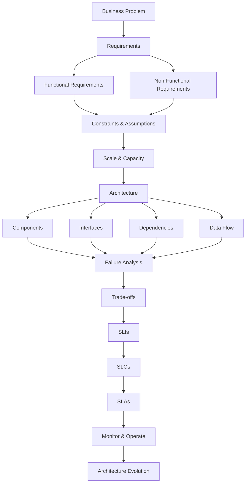

Core principle : 
Requirements -> Architecture -> Implementation
 
NOT:
Technology -> Architecture -> Find a problem to solve

**4. HLD vs LLD**
4.1 High-Level Design

High-Level Design describes the major architectural building blocks of a system, their responsibilities, communication patterns, data flows and deployment relationships.

HLD answers:
"What are the major components and how do they interact?"

Example:

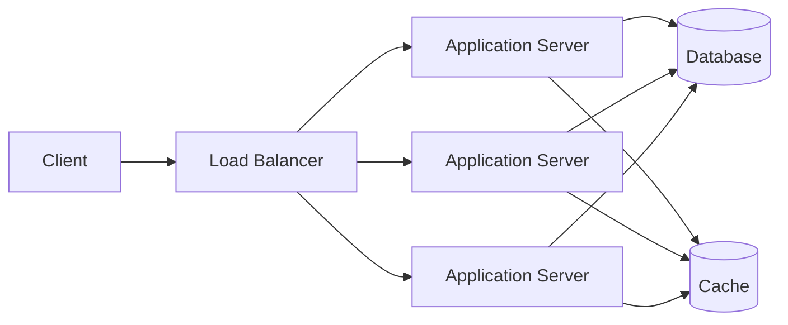

4.2 Low-Level Design

Low-Level Design describes the internal structure and behavior of individual components, including classes, interfaces, methods, data models, algorithms and design patterns.

Example:

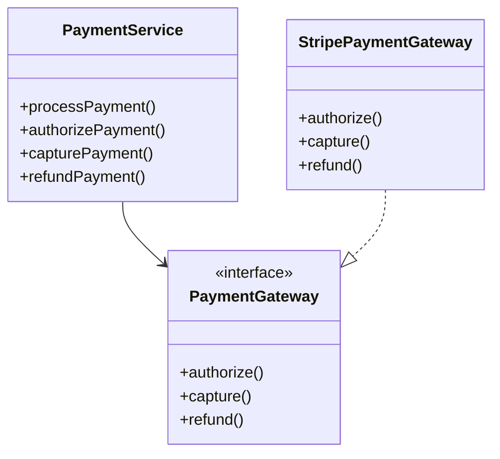

HLD vs LLD -

HLD                         	LLD
System architecture	         Component internals
Services	                 Classes
Databases	                 Entities
APIs	                     Methods
Queues	                     Algorithms
Scaling	                     Design patterns
Deployment	                 Object interactions
Data flow	                 Detailed implementation

Remember
HLD = Zoomed OUT
LLD = Zoomed IN

5. Functional Requirements
 
Functional requirements describe the capabilities and behaviors that the system must provide to its users or other systems.

They answer:
WHAT should the system do?

Example — File Sharing System

User can:
1. Register
2. Login
3. Upload file
4. Download file
5. Delete file
6. Share file
7. Revoke access
8. Generate shareable link

Functional Requirement Decomposition

"Upload File" sounds simple.
But let's decompose it:

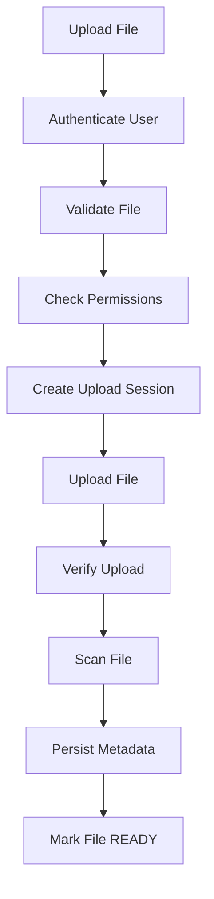
A simple requirement often hides multiple workflows.

6. Non-Functional Requirements
 
Non-functional requirements define the quality attributes, operational characteristics and constraints under which the system must perform its functionality.

They answer:
HOW WELL should the system work?

Examples
Functional:
User can download a file.

Non-functional:
99.99% availability.
p99 latency < 200 ms.
System supports 100,000 requests/sec.
Uploaded files must not be lost.
Data must be encrypted.
System must support 100 million users.

NFR Categories

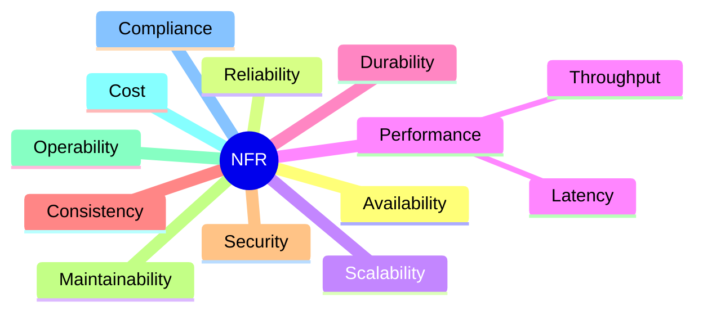

**7. Availability** 

Availability is the proportion of time a system is operational and accessible when users need it.

Basic formula:
Availability =

Available Time
----------------------------
Total Observed Time

Or:

Availability = 1 - Downtime / Total Time

Availability Examples : 

Availability	               Approx. Annual Downtime
99%	                           3.65 days
99.9%	                       8.76 hours
99.95%	                       4.38 hours
99.99%	                       52.6 minutes
99.999%	                       5.26 minutes

[Source: Google SRE availability guidance.](https://sre.google/sre-book/availability-table/?utm_source=chatgpt.com)

Availability Isn't "Zero Downtime"
A 99.99% available system is explicitly allowed approximately 52.6 minutes of annual unavailability.

Therefore:

Higher availability
        ↓
Less allowed downtime
        ↓
More engineering effort
        ↓
Usually higher cost

**8. Reliability**

Reliability is the ability of a system to consistently perform its intended function correctly over time and under expected conditions.

Example:
Payment API:

HTTP 200
Payment successful

But the system actually charges the customer twice.

Availability  → Good
Correctness   → Bad
Reliability   → Bad

Availability vs Reliability :
Availability
     ↓
"Can I access the service?"

Reliability
     ↓
"Does the service consistently
perform the intended function correctly?"

A system can be:
Available + Unreliable

For example:

API always responds
but frequently returns incorrect results.

**9. Scalability**
 
Scalability is the ability of a system to accommodate increasing workload while maintaining acceptable performance and operational characteristics.

Workload may grow through:

Users
Requests
Data
Transactions
Messages
Files
Geographic regions

Vertical Scaling : 
Increase the resources of one machine.

Before
┌────────────────────┐
│ 4 CPU              │
│ 16 GB RAM          │
└────────────────────┘

After
┌────────────────────┐
│ 64 CPU             │
│ 256 GB RAM         │
└────────────────────┘

Advantages : 
Simple.
Less distributed-system complexity.
Easier operational model.

Disadvantages : 
Hardware limits.
Expensive at high scale.
Can remain a single failure domain.

Horizontal Scaling : 
Add more machines.

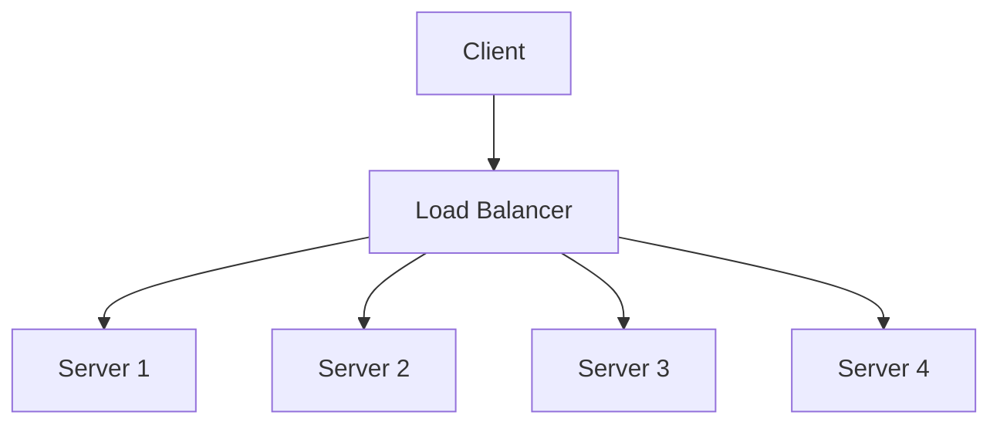

Advantages : 
Higher capacity.
Redundancy.
Better fault tolerance.
Elastic scaling.

Disadvantages : 
Distributed-system complexity.
Network communication.
Load balancing.
State management.
Data consistency challenges.

**10. Performance**

Performance describes how efficiently a system processes work, commonly expressed through latency, throughput and resource utilization.

Performance includes:
Latency
Throughput
CPU utilization
Memory utilization
Disk I/O
Network utilization
Database response time

**11. Latency**

Latency is the time taken to complete an operation from the relevant start point to the relevant completion point.

Example:

Request
   │
   ├── Network      → 20ms
   ├── Application  → 30ms
   ├── Database     → 40ms
   └── Network      → 20ms
                         │
                         ▼
                     110ms
Percentiles
Never rely exclusively on average latency.

Example:

p50  = 50ms
p95  = 100ms
p99  = 250ms
p99.9 = 2 seconds

Interpretation:

50%    ≤ 50ms
95%    ≤ 100ms
99%    ≤ 250ms
99.9%  ≤ 2 seconds

[Google SRE recommends looking at latency distributions and tail behavior rather than relying only on averages.](https://sre.google/sre-book/service-level-objectives/?utm_source=chatgpt.com)

Why Average Latency Can Mislead - 
Suppose:

99 requests = 10ms
1 request  = 10 seconds

The average can appear deceptively reasonable while one request has experienced extreme latency.

Therefore:

Average latency
       ≠
Complete latency picture

For production systems, tail latency such as p95/p99/p99.9 is often much more useful.

**12. Throughput**

Throughput is the amount of work a system successfully processes per unit of time.

Examples:

10,000 requests/sec
50,000 messages/sec
500 transactions/sec
2 GB/sec
1 million events/minute

Latency vs Throughput : 

Latency	                                       Throughput
Time per operation	                           Operations per unit time
Usually measured in ms/sec	                   Usually req/sec, events/sec
User responsiveness	                           System processing capacity

Think about a highway:

Latency = Time taken by one vehicle to reach destination

Throughput = Vehicles passing through the highway per minute

A system can have:
Low latency + low throughput

or:

High throughput + high latency

These are independent dimensions.

**13. Durability**
 
Durability is the probability that successfully stored data remains available and intact despite failures.

Example:

User uploads contract.pdf

System:
"Upload successful."

Then:

Server crashes
Disk fails
Machine is destroyed
Availability zone fails

Question:
Does contract.pdf still exist?

That's durability.

Availability vs Durability
Availability
    ↓
Can I access it NOW?

Durability
    ↓
Will my data SURVIVE failures?

Example:

Database temporarily unavailable

Availability → Bad
Durability   → Could still be good

**14. Consistency**

Consistency describes the guarantees governing what values different readers can observe when data is replicated or concurrently modified.

Example:

User updates:

Name = Jay

Suppose:

Primary DB
Name = Jay

Replica DB
Name = OldName

Another user reads from the replica.

What should they observe?

That question is about consistency.

Beginner Mental Model
Write
  │
  ▼
Primary
  │
  ├────────► Replica 1
  │
  └────────► Replica 2

Possible behavior:

Strong consistency
    ↓
Readers observe the latest committed value
according to the consistency model.

Eventual consistency
    ↓
Replicas may temporarily differ,
but converge eventually if updates stop.

This topic will become a major section later in the roadmap.

**15. Security**

Security is the collection of mechanisms and architectural properties that protect systems, data, identities and operations against unauthorized access, modification, disclosure, destruction and abuse.

Major areas:

Authentication
Authorization
Encryption
Secrets Management
Input Validation
Network Security
Auditing
Identity
Threat Modeling
Rate Limiting
Data Protection

Authentication vs Authorization : 
Authentication
=
Who are you?

Authorization
=
What are you allowed to do?

Example:

Jay logs in
    ↓
Authentication

Jay tries to access
another user's private file
    ↓
Authorization check
    ↓
DENIED

**16. Maintainability**

Maintainability is the ease with which a system can be understood, modified, tested, extended and repaired.

Important properties:

High Cohesion
Low Coupling
Clear Boundaries
Good Documentation
Testability
Observability

Bad:
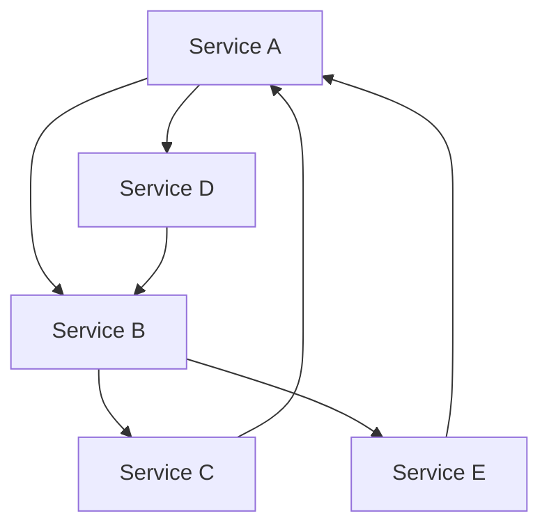
Everything depends on everything.

Better:
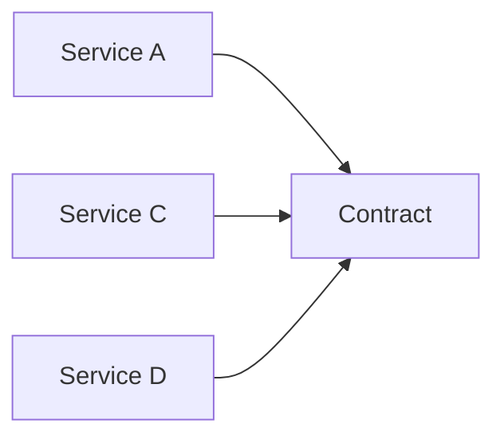
Clear contracts reduce coupling.

**17. Operability**

Operability is the ease with which engineers can deploy, monitor, diagnose, recover and operate a system in production.

Questions:

Can we detect failures?
Can we investigate failures?
Can we rollback?
Can we restart safely?
Can we trace requests?
Can we measure latency?
Can we identify bottlenecks?
Can we recover data?

Observability
A production system should generally expose:
Logs
Metrics
Traces

The classic model:

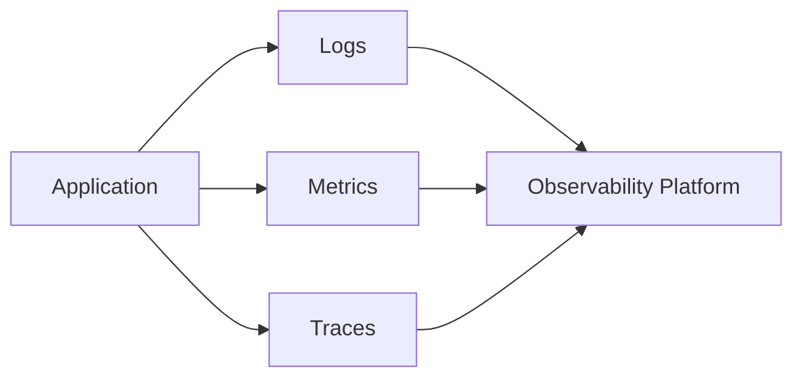
We'll study observability deeply in a later week.

**18. Cost**
Architecture must be economically sustainable.

Consider:

Architecture A

Cost = $5K/month
Availability = 99.9%

Architecture B

Cost = $50K/month
Availability = 99.99%

The correct choice depends on:

Business value
Criticality
Revenue impact
Risk
Expected traffic
Regulatory requirements
Recovery requirements

Important principle : 
Don't optimize technical metrics in isolation from business value.

**19. Compliance**

Compliance is the requirement to operate within applicable laws, regulations, contracts, standards and organizational policies.

Examples:

Data residency
Data retention
Audit logging
Privacy
Access controls
Encryption
Financial regulations
Healthcare regulations

Compliance can become an architectural constraint.

Example:

Requirement:

Customer data must remain within India.

Architecture may therefore require:

Users
  │
  ▼
India Region
  │
  ├── Application
  ├── Database
  └── Object Storage

  
**20. Constraints**

A constraint is a boundary or limitation that restricts the set of acceptable design solutions.

Examples:

Budget ≤ ₹10 lakh/month
Must use PostgreSQL
Must run on Kubernetes
Data must remain in India
Maximum downtime during migration = 5 minutes
Maximum file size = 10 GB
Must integrate with legacy system

Constraint vs Requirement : 

Requirement:
System must support file uploads.

Constraint:
Maximum file size = 10 GB.

Requirement defines desired behavior.

Constraint limits implementation possibilities.

**21. Assumptions**

An assumption is an explicitly stated belief about users, workload, environment, data, dependencies or business behavior that is used because complete information is unavailable.

Example:

Assumption:

Average file size ≈ 20 MB.
Peak traffic ≈ 5 × average traffic.
80% of traffic originates from three regions.

Why Explicit Assumptions Matter ?

Suppose we assume:

10,000 requests/sec
and build an architecture.

Later actual traffic becomes:
100,000 requests/sec

The original architecture may no longer work.

Therefore:

Assumption
     ↓
Architecture decision
     ↓
If assumption changes
     ↓
Architecture may change

**22. Architecture**

Architecture is the set of important structural decisions that define how a system is divided into components, how those components interact, how data flows, how the system is deployed, and how critical quality attributes are achieved.

Architecture includes:
Components
Interfaces
Data Flow
Dependencies
Storage
Communication
Deployment
Scaling
Failure Handling
Security
Observability

Architecture Is Not Just a Diagram

This:

Client → Server → Database

is a diagram.

Architecture also includes decisions such as:

Why synchronous communication?
Why PostgreSQL?
Why cache?
Why replication?
Why asynchronous processing?
Why object storage?
Why multi-region?
What happens during failure?

**23. Components**

A component is a cohesive building block responsible for a well-defined part of system behavior.

Examples:

Authentication Service
Order Service
Payment Service
Database
Cache
Message Broker
Object Storage
Search Engine
Load Balancer
CDN
Worker
Scheduler

Component Responsibilities : 

A good component should have a clear responsibility.

Payment Service
    ↓
Payment-related business operations

Notification Service
    ↓
Notification delivery

Search Service
    ↓
Search/indexing operations

Avoid:

God Service
    ↓
Does everything

**24. Interfaces**

An interface is a defined contract through which one component interacts with another.

Example:
POST /payments

Request:
{
  "orderId": "ORD-1001",
  "amount": 1500,
  "currency": "INR"
}

Response:
{
  "paymentId": "PAY-1001",
  "status": "AUTHORIZED"
}

Interface Contract - 

A production interface should clarify:
Endpoint
Method
Request
Response
Authentication
Authorization
Errors
Timeouts
Retries
Idempotency
Versioning
Rate Limits

Example:
POST /v1/payments

Headers:
Authorization
Idempotency-Key

Request:
orderId
amount
currency

Response:
paymentId
status

**25. Dependencies**

A dependency exists when one component requires another component, service, resource or external system to perform some operation.

Example:
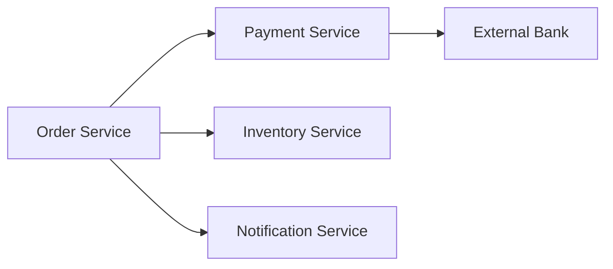

Hard Dependency
Order
  │
  ▼
Payment
  │
  X DOWN

Order fails

Soft Dependency
Order
  │
  ├── Payment
  │
  └── Notification

Notification DOWN

Order still succeeds
Notification retries asynchronously

Dependency Failure - 
If:

A = 99.99%
B = 99.99%
C = 99.99%

and all are hard dependencies:

Combined Availability
≈ A × B × C
≈ 99.99% × 99.99% × 99.99%
≈ 99.97%

Therefore:
Adding dependencies can reduce overall availability.

This is one of the most important architectural insights from Day 1.

**26. Trade-offs**

A trade-off occurs when improving one property of a system causes another property to become worse, more expensive or more complex.

There is rarely a universally best architecture.

Common Trade : 
Consistency
     ↕
Availability

Latency
     ↕
Durability

Cost
     ↕
Reliability

Simplicity
     ↕
Scalability

Strong Consistency
     ↕
Global Low Latency

Synchronous Processing
     ↕
Operational Simplicity

Asynchronous Processing
     ↕
Eventual Consistency

Example: Cache
Decision:
Add Redis

Benefits:
Lower latency
Reduced DB load
Higher read throughput

Costs:
Cache invalidation
Stale data
Extra infrastructure
Failure handling
Memory cost
Operational complexity

Therefore:
"Use Redis" is not a design explanation.

A design explanation is:
"Because this workload has high read volume, frequently repeated reads and a latency-sensitive path, we introduce a cache to reduce database load and latency. The trade-offs are stale data, invalidation complexity and an additional operational dependency."

**27. Requirement vs Constraint vs Goal vs Metric vs SLI vs SLO vs SLA**
This is one of the most important sections of Day 1.

Requirement - 
Something the system must provide or satisfy.

Example:
User can download files.

Constraint - 
A limitation imposed on the solution.

Example:
Maximum infrastructure budget = ₹10 lakh/month.

Goal - 
A desired outcome.

Example:
Provide fast file downloads.

"Fast" is not sufficiently measurable yet.

Metric - 
A measurable quantity.

Examples:
Latency
Error Rate
Requests/sec
CPU utilization
Availability

SLI - 
Service Level Indicator — a quantitative measurement of an aspect of service behavior.

Example:

Successful Requests
-------------------
Total Valid Requests

SLO - 
Service Level Objective — the target value/range for an SLI.

Example:
99.95% of valid requests
must succeed.

[Google SRE provides the standard SLI/SLO terminology and examples.](https://sre.google/sre-book/service-level-objectives/?utm_source=chatgpt.com)

SLA - 
Service Level Agreement — a formal agreement defining expected service levels and typically the consequences of failing to meet them.

Example:
Provider guarantees 99.9% monthly availability.

If availability falls below the contractual threshold, customer receives service credits.

Complete Relationship
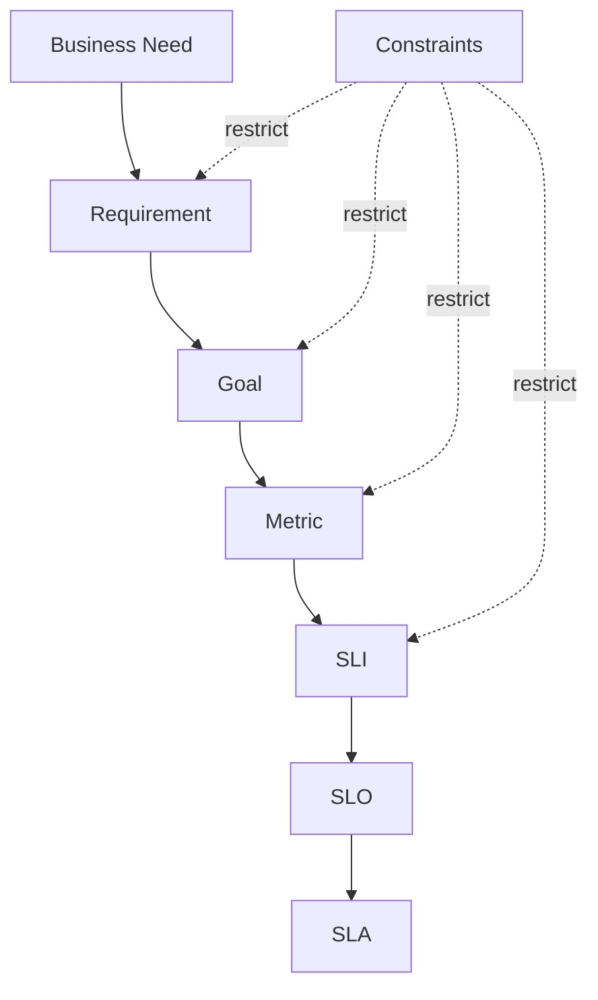

Remember : 
Requirement = What must happen?
Constraint = What limits us?
Goal = What outcome do we want?
Metric = What can we measure?
SLI = What aspect of service are we measuring?
SLO = What target are we setting?
SLA = What contractual commitment exists?

**28. Error Budget**

If:
SLO = 99.9%

Then:
Error Budget = 100% - 99.9% = 0.1%

The error budget represents the amount of unreliability permitted while still meeting the SLO.

[Google SRE uses error budgets as a mechanism for balancing reliability and development velocity.](https://sre.google/sre-book/service-best-practices/?utm_source=chatgpt.com)

Error Budget Concept : 
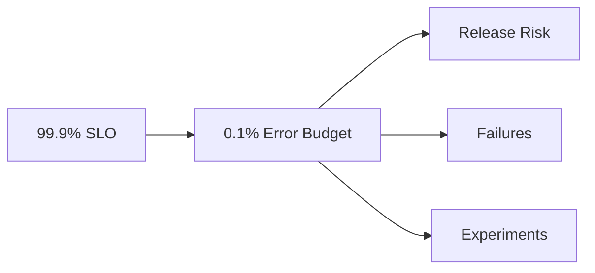

If the service has exhausted its budget:
Prioritize reliability
        ↓
Reduce risky releases
        ↓
Fix systemic failures

If considerable budget remains:
More room for experimentation and feature velocity

**29. Brainstorming Framework**
This is the process I want to use for every system design problem going forward.

Step 1 — Clarify the Problem
Ask:

Who are the users?
What problem are we solving?
What is in scope?
What is out of scope?

Step 2 — Functional Requirements
Ask:

What can the user do?
What operations exist?
What are the primary workflows?

Step 3 — Non-Functional Requirements
Ask:

How available?
How fast?
How scalable?
How durable?
How secure?
How consistent?

Step 4 — Scale
Ask:

How many users?
DAU?
Requests/sec?
Peak requests/sec?
Read/write ratio?
Data size?
Growth rate?

Step 5 — Constraints
Ask:

Budget?
Technology restrictions?
Regulations?
Legacy systems?
Geography?
Deadlines?

Step 6 — Assumptions
Explicitly write:

We assume...
Never hide assumptions.

Step 7 — Critical User Journey
Example:

User
 ↓
Login
 ↓
Search
 ↓
View
 ↓
Purchase
 ↓
Payment
 ↓
Confirmation

Then ask:

Which components are critical to this journey?

Step 8 — Build the Simplest Architecture
Start with:

Client
  ↓
Application
  ↓
Database

Then identify bottlenecks.

Step 9 — Scale the Architecture
Only introduce:

Cache
Queue
Replication
Sharding
CDN
Load Balancer
Microservices
Object Storage

when requirements justify them.

Step 10 — Failure Analysis
For every component ask:

What if it fails?
What if it becomes slow?
What if it returns incorrect data?
What if the network fails?
What if traffic suddenly increases?
What if the dependency is unavailable?

Step 11 — Trade-offs
For every major decision:

Why?
What does it improve?
What does it make worse?
What does it cost?
What complexity does it introduce?

**30. Case Study — File Sharing System**
Let's apply everything.

Problem
Design a file-sharing system where users can register, login, upload files, download files and share files.

Step 1 — Functional Requirements
User can:

1. Register
2. Login
3. Upload file
4. Download file
5. Delete file
6. Share file
7. Revoke sharing
8. Generate shareable URL
   
Step 2 — NFRs
Suppose we establish:

100M registered users
10M uploads/day
50M downloads/day
Average file size = 20 MB
Maximum file size = 10 GB
High durability
High availability
Low download latency
Secure private files

These are assumptions/targets that must be confirmed with the business in a real design.

Step 3 — Capacity Reasoning

Daily upload volume:
10M × 20MB
= 200TB/day

Annual raw volume:
200TB × 365
≈ 73PB/year

And this excludes:

Replication
Backups
Versions
Metadata
Temporary files

Immediately:
Storing file bytes directly inside a traditional relational database becomes questionable.

Step 4 — Separate Metadata From File Content
Metadata
   ↓
Relational / NoSQL Database

File Bytes
   ↓
Object Storage

Architecture :
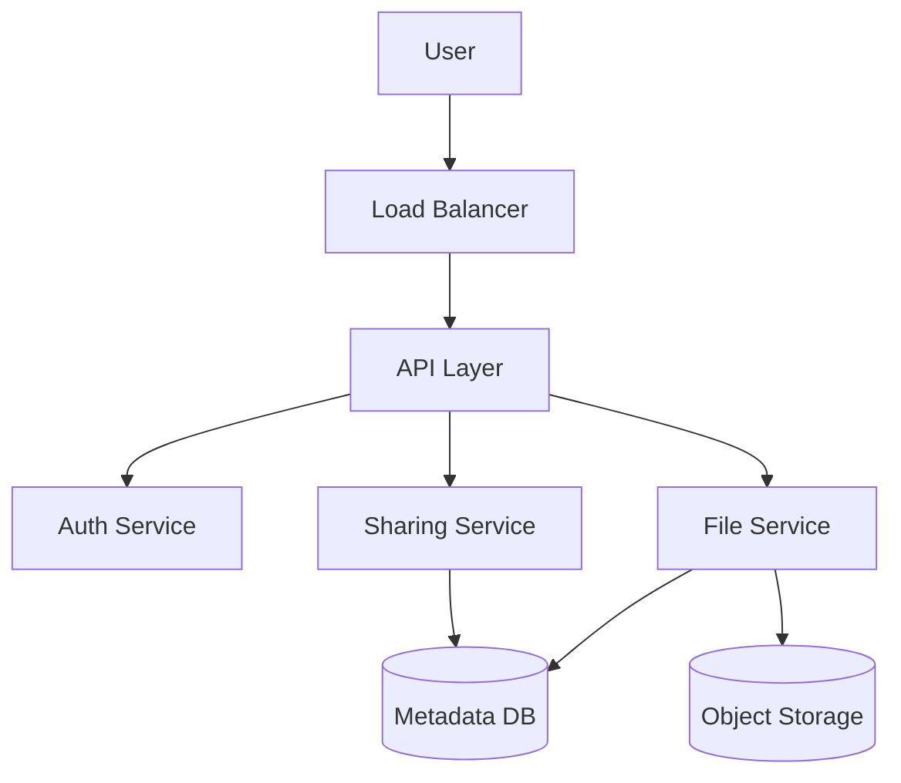

Step 5 — Optimize Upload
Naive:

User
 ↓
Application Server
 ↓
Object Storage

Problem:

10 GB file
     ↓
Application Server
     ↓
Bandwidth bottleneck

Better:

User
 │
 │ 1. Request upload
 ▼
Application
 │
 │ 2. Generate signed URL
 ▼
User
 │
 │ 3. Upload directly
 ▼
Object Storage

Upload Workflow : 
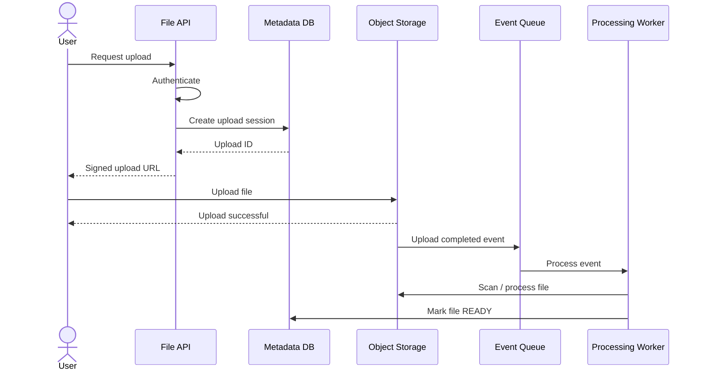

Why Asynchronous Processing?

Suppose virus scanning takes:
5 seconds

If upload API waits:

Upload
 ↓
Scan
 ↓
Metadata processing
 ↓
Response

User waits 5+ seconds.

Instead:

Upload
 ↓
Accept
 ↓
Queue
 ↓
Process asynchronously

Benefits:
Lower request latency
Better decoupling
Independent scaling
Failure isolation

Costs:
Eventual consistency
More infrastructure
Retry handling
Duplicate event handling
Operational complexity

Again:
Trade-off.

**31. Case Study — URL Shortener**
Problem:

Create short URL
Redirect short URL

Functional Requirements : 
Create short URL
Redirect short URL

Optional:
Delete URL
Expire URL
Custom alias
Analytics
Scale Assumption

Suppose:
1M URL creations/day
1B redirects/day

Average redirect traffic:

1,000,000,000
----------------
86,400

≈ 11,574 req/sec

Peak could be several times higher.

Important Observation
Writes
   ↓
1M/day

Reads
   ↓
1B/day

Therefore:

READ >> WRITE

This should influence architecture.

Candidate Architecture : 
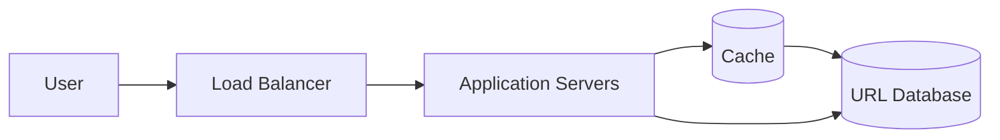

Request :
GET /abc123

Flow :
Request
   ↓
Cache
   │
   ├── HIT → Redirect
   │
   └── MISS
          ↓
        Database
          ↓
        Cache
          ↓
        Redirect

Cache Workflow : 
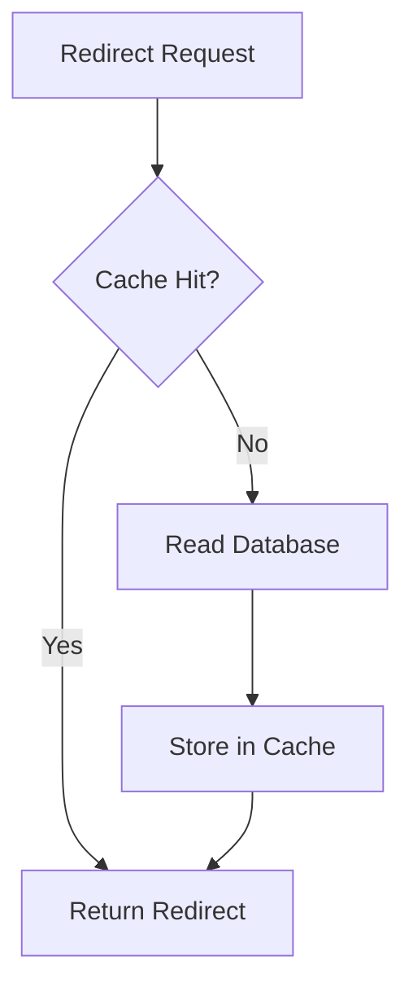

Brainstorming Question

Now you should ask:
What if one URL becomes extremely popular?

Example:
youtube.com/abc123

receives:

500,000 requests/sec

Now you should start thinking about:

Hot keys
Cache replication
CDN
Load distribution
Connection limits
Rate limiting

This is exactly how I want you to brainstorm.

Don't memorize the answer first.
Derive it from the workload.

**32. Design Principles**
These principles should remain visible throughout your repository.

Principle 1 — Requirements First
Requirements
      ↓
Architecture
      ↓
Technology

Principle 2 — Measure Before Optimizing
Don't say:

"Database is slow."

Measure:

p95 DB latency
p99 DB latency
QPS
CPU
IOPS
Connection pool
Lock contention

Principle 3 — Every Dependency Has a Cost
Dependency
    ↓
Network
    ↓
Latency
    ↓
Failure possibility
    ↓
Operational complexity

Principle 4 — Prefer Simplicity
Don't introduce complexity without a reason.

Principle 5 — Design for Failure
Assume:

Servers fail
Networks fail
Databases fail
Queues fail
Caches fail
Dependencies become slow
Traffic spikes
Deployments fail

Principle 6 — Separate Critical and Non-Critical Paths
Critical:
Payment

Non-critical:
Analytics notification

Critical operations may need:

Stronger reliability
Stronger consistency
More redundancy

Principle 7 — Every Architecture Has Trade-offs
Never say:

"This architecture is best."

Say:

"This architecture is appropriate given these requirements and constraints."

33. Interview Perspective
When asked:

"Design a file-sharing system."

Weak opening
"I'll use Spring Boot, MySQL, Redis and Kafka."

Strong opening
"Before selecting technologies, I'll clarify the functional requirements, expected scale, file-size distribution, availability and durability targets, access patterns, consistency requirements, security constraints and geographic distribution."

That's the mindset expected from a system designer.

Strong Interview Flow : 

1. Clarify requirements
        ↓
2. State assumptions
        ↓
3. Estimate scale
        ↓
4. Identify APIs
        ↓
5. Model data
        ↓
6. Design HLD
        ↓
7. Explain critical flows
        ↓
8. Identify bottlenecks
        ↓
9. Scale the system
        ↓
10. Discuss failures
        ↓
11. Discuss trade-offs
        ↓
12. Discuss future evolution

**34. Day 1 Summary**
The Most Important Formula

Business Problem
       ↓
Requirements
       ↓
Constraints + Assumptions
       ↓
Scale
       ↓
Architecture
       ↓
Components
       ↓
Interfaces
       ↓
Dependencies
       ↓
Failure Modes
       ↓
Trade-offs
       ↓
SLIs
       ↓
SLOs
       ↓
Operations
       ↓
Evolution

The Golden Rule : 
Never start system design by choosing technologies. Start by understanding the problem.

The Second Golden Rule : 
A system is not successful merely because it works. It must work with the required availability, reliability, scalability, performance, durability, security, maintainability, operability and cost.

The Third Golden Rule : 
Every architectural decision is a trade-off.

The Fourth Golden Rule : 
The simplest architecture that satisfies the requirements is usually a better starting point than an unnecessarily complex architecture.

**35. Self Assessment**
Before moving to Day 2, you should be able to answer these without looking at your notes.

Fundamental
What is system design?
What is architecture?
What is HLD?
What is LLD?
What is a component?
What is an interface?
What is a dependency?

Requirements
What is a functional requirement?
What is an NFR?
Give five examples of each.
Why are NFRs important?
Quality Attributes
Availability vs reliability?
Reliability vs durability?
Latency vs throughput?
Vertical vs horizontal scaling?
What is consistency?
What is operability?

Architecture
What is a hard dependency?
What is a soft dependency?
Why can dependencies reduce availability?
What is a trade-off?
Why isn't the most complex architecture necessarily the best?

SRE
What is an SLI?
What is an SLO?
What is an SLA?
What is an error budget?
How are SLI, SLO and SLA related?

System Design Thinking
Given:

10M users
1M writes/day
100M reads/day
99.99% availability
p99 < 200ms

Can you begin asking:

What should I clarify?
What assumptions should I make?
What should I calculate?
What architecture might satisfy this?
Where are the bottlenecks?
What happens if components fail?
What trade-offs am I making?

If yes, Day 1 has done its job.

**36. Further Reading**

Google SRE : 
[Service Level Objectives](https://sre.google/sre-book/service-level-objectives/?utm_source=chatgpt.com) - SLI, SLO, SLA, latency, availability and error budgets.
[Availability Table](https://sre.google/sre-book/availability-table/) - availability percentages and downtime.
[Implementing SLOs](https://sre.google/workbook/implementing-slos/?utm_source=chatgpt.com) - practical SLO design.

AWS : 
[AWS Well-Architected Framework](https://docs.aws.amazon.com/wellarchitected/latest/framework/definitions.html?utm_source=chatgpt.com) - architecture principles and quality attributes.
[Reliability Pillar](https://docs.aws.amazon.com/wellarchitected/latest/reliability-pillar/welcome.html?utm_source=chatgpt.com) - reliability, availability, dependencies and failure handling.
[Security Pillar](https://docs.aws.amazon.com/wellarchitected/latest/security-pillar/security.html?utm_source=chatgpt.com) - security architecture.
[Cost Optimization](https://docs.aws.amazon.com/wellarchitected/latest/cost-optimization-pillar/welcome.html) - architectural cost considerations.

Microsoft : 
[Azure Architecture Center](https://learn.microsoft.com/en-us/azure/architecture/) - architecture patterns, principles and reference architectures.
[Build for Business Needs](https://learn.microsoft.com/en-us/azure/architecture/guide/design-principles/build-for-business?utm_source=chatgpt.com) - requirements-driven architecture.
[Azure Well-Architected Framework](https://learn.microsoft.com/en-us/azure/well-architected/) - reliability, security, performance, cost and operational considerations.

Martin Fowler : 
[Software Architecture Guide](https://www.martinfowler.com/architecture/?utm_source=chatgpt.com) - architecture concepts and architectural decision-making.
