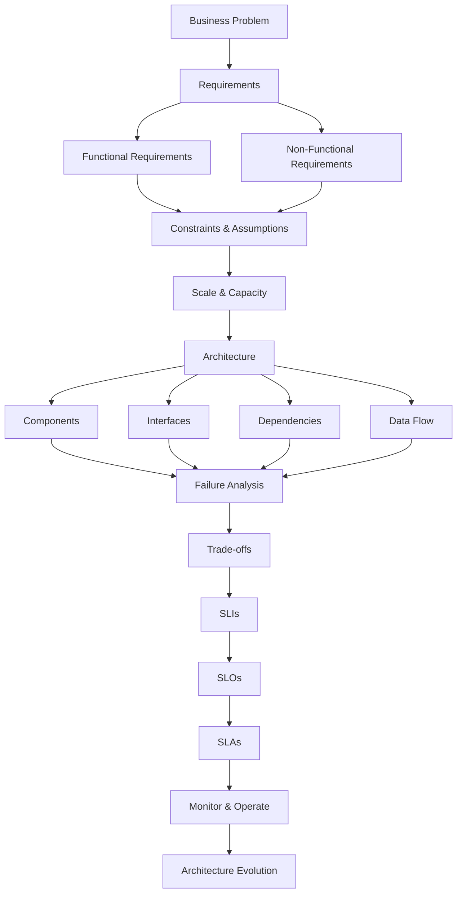

**What is System Design?**

Goal: Build the fundamental mental model required to analyze, design, communicate, evaluate, and evolve large-scale software systems.

__Table of Contents__
1. Learning Objectives
2. What is System Design?
3. System Design Mental Model
4. HLD vs LLD
5. Functional Requirements
6. Non-Functional Requirements
7. Availability
8. Reliability
9. Scalability
10. Performance
11. Latency
12. Throughput
13. Durability
14. Consistency
15. Security
16. Maintainability
17. Operability
18. Cost
19. Compliance
20. Constraints
21. Assumptions
22. Architecture
23. Components
24. Interfaces
25. Dependencies
26. Trade-offs
27. Requirement vs Constraint vs Goal vs Metric vs SLI vs SLO vs SLA
28. Error Budget
29. Brainstorming Framework
30. Case Study — File Sharing System
31. Case Study — URL Shortener
32. Design Principles
33. Interview Perspective
34. Day 1 Summary
35. Self Assessment
36. Further Reading

1. Learning Objectives

By the end of Day 1, you should be able to:

Explain what system design means.
Understand the difference between HLD and LLD.
Identify functional requirements.
Identify and categorize NFRs.
Explain availability, reliability, scalability and durability.
Distinguish latency from throughput.
Understand consistency at a high level.
Identify constraints and assumptions.
Explain architecture, components, interfaces and dependencies.
Identify architectural trade-offs.
Understand Requirement vs Constraint vs Goal vs Metric.
Understand SLI, SLO and SLA.
Understand error budgets.
Approach a system-design problem systematically.
Start thinking from requirements → architecture, rather than technology → architecture.

2. What is System Design?
Definition
System design is the process of transforming business and technical requirements into a structured architecture consisting
of components, interfaces, data flows, dependencies, deployment strategies, and operational mechanisms while satisfying
required functional and non-functional properties under given constraints.

A simpler definition:
System design is deciding how different parts of a software system should work together to solve a problem reliably,
efficiently, securely and at the required scale.

The Fundamental Question

A beginner asks:
"Which technology should I use?"

A system designer asks:
"What problem are we solving, what are the requirements, what constraints exist, what scale are we expecting,
what can fail, and what trade-offs are acceptable?"

3. System Design Mental Model
The complete system-design thought process:

Core principle : 
Requirements -> Architecture -> Implementation
 
NOT:
Technology -> Architecture -> Find a problem to solve
