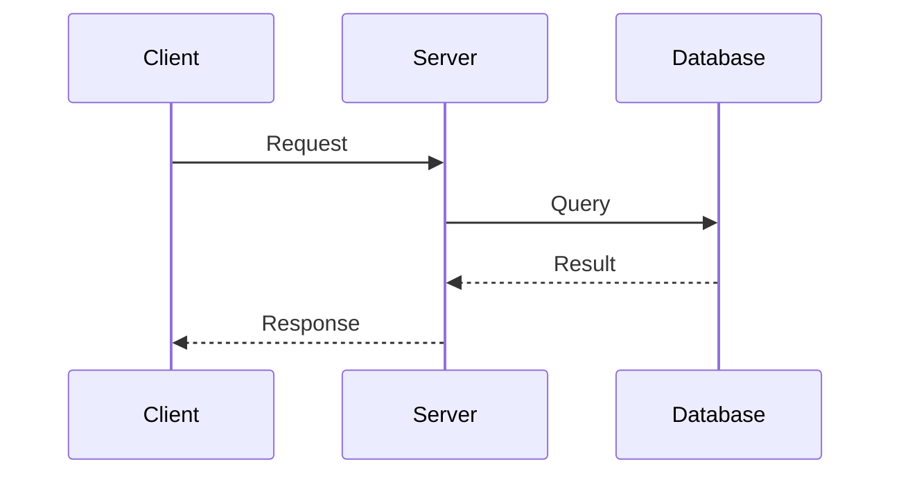
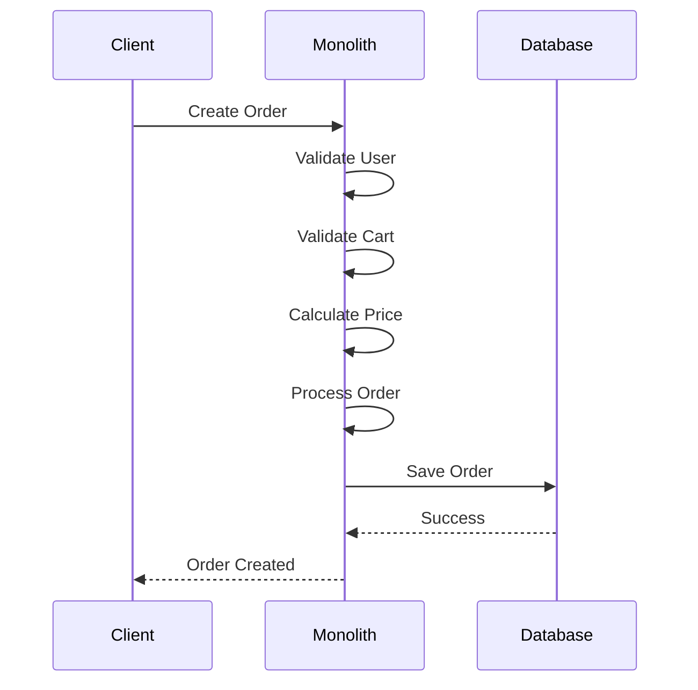
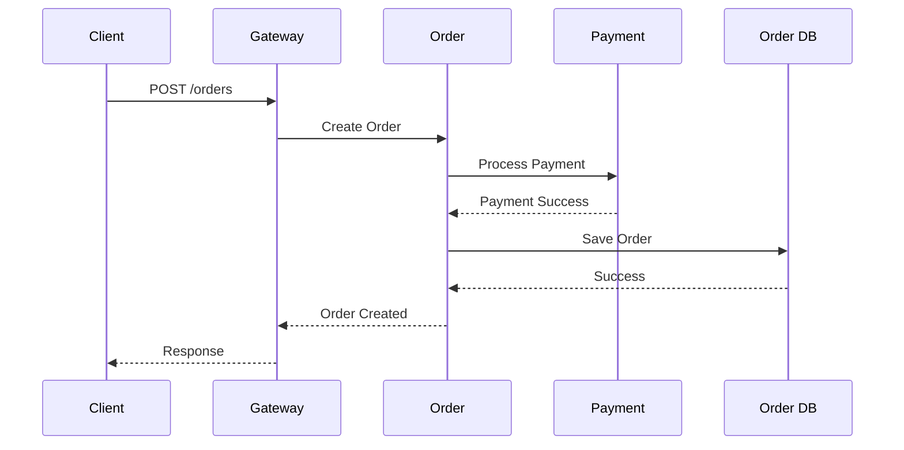
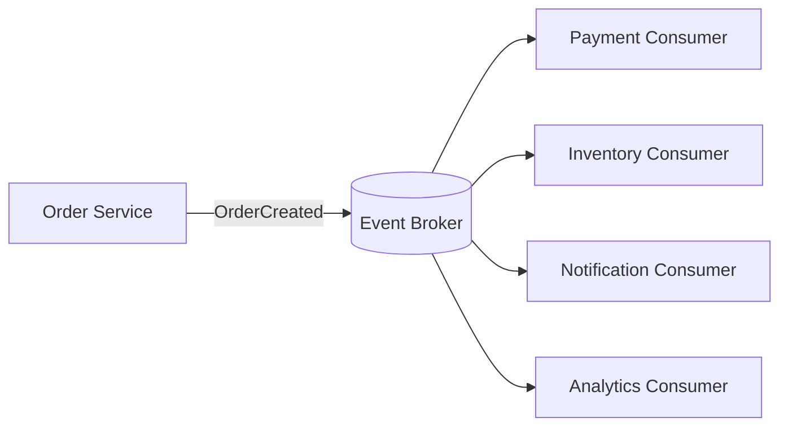
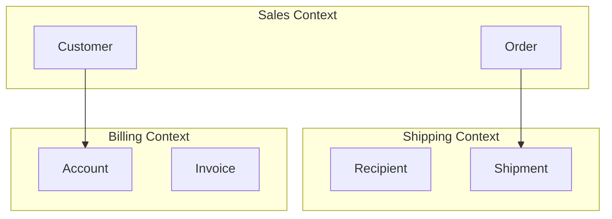
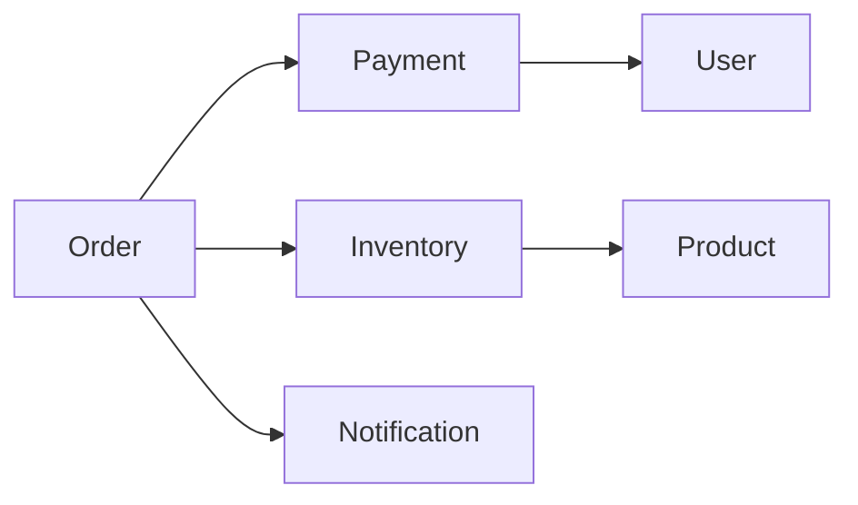
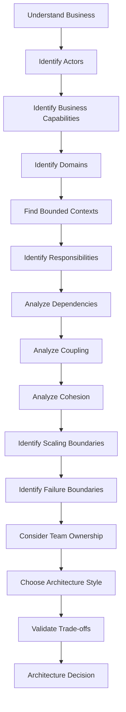
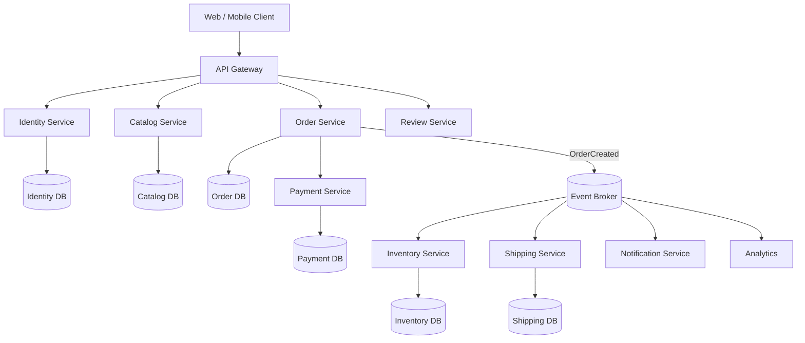

**Architecture Fundamentals**

Goal: Learn how to structure software systems, identify architectural boundaries, decompose business domains, analyze dependencies,
and make architecture decisions based on trade-offs rather than technology preferences.

__📚 Table of Contents__
1. What is Software Architecture?
2. Architecture vs Design
3. Architecture Styles
3.1 Client-Server
3.2 Peer-to-Peer
3.3 Monolith
3.4 Modular Monolith
3.5 SOA
3.6 Microservices
3.7 Serverless
3.8 Event-Driven Architecture
3.9 Distributed Systems
4. Architecture Style Comparison
5. Architectural Decomposition
5.1 Functional Decomposition
5.2 Domain Decomposition
5.3 Bounded Contexts
5.4 Dependency Analysis
5.5 Coupling
5.6 Cohesion
5.7 Conway's Law
5.8 Reverse Conway Maneuver
6. Distributed Monolith
7. How to Choose an Architecture
8. Architecture Decision Framework
9. Architecture Evolution
10. Complete Case Study — E-Commerce
11. Java Implementation Examples
12. Architecture Anti-Patterns
13. Interview Brainstorming Framework
14. Revision Cheat Sheet
15. Practice Problems
16. Further Reading

**1. What is Software Architecture?**

Software architecture is the high-level structure of a software system that defines its major components, responsibilities, relationships, communication mechanisms, data ownership, deployment boundaries, and the constraints governing how those components evolve.

Architecture answers questions such as:

What are the major components?
What responsibility does each component have?
Which components communicate?
How do they communicate?
Where does data live?
Which component owns which data?
Which components can scale independently?
Which components can fail independently?
Which components can be deployed independently?
How are security boundaries defined?
How are teams organized around the system?

Architecture Mental Model : 

                    SOFTWARE ARCHITECTURE
                            |
          +-----------------+------------------+
          |                 |                  |
       Structure         Behavior          Constraints
          |                 |                  |
      Components        Communication        Security
      Services          Workflows            Compliance
      Modules           Events               Technology
      Databases         Requests             Organization
          |
          v
       Boundaries
          |
          v
   Responsibilities
          |
          v
      Dependencies
      
**2. Architecture vs Design**

Architecture and design are related but operate at different levels.

Architecture

Focuses on:

System
 ├── Components
 ├── Services
 ├── Databases
 ├── Communication
 ├── Deployment
 ├── Scalability
 └── Reliability
 
Design

Focuses more on:

Component
 ├── Classes
 ├── Interfaces
 ├── Algorithms
 ├── Design Patterns
 └── Data Structures
 
Example

Architecture:

Order Service
      |
      v
Payment Service
      |
      v
Payment Database

Design:

class PaymentService {

    private final PaymentRepository repository;
    private final PaymentGateway gateway;

    public PaymentResult processPayment(PaymentRequest request) {
        // business logic
    }
}

Architecture determines where things live.

Design determines how things work internally.

**3. Architecture Styles**

Architecture style is a recurring way of organizing a system.

Important styles:

Client-Server
Monolith
Modular Monolith
SOA
Microservices
Serverless
Event-Driven
Distributed Systems
Peer-to-Peer

Important: These styles are not always mutually exclusive.

A modern system can simultaneously be:

Microservices
      +
Event-Driven
      +
Serverless
      +
Distributed

**3.1 Client-Server**

Client-server architecture separates a system into clients that request services and servers that provide those services.

+----------+              +----------+
|  Client  | -----------> |  Server  |
+----------+   Request    +----------+
      ^                       |
      |                       |
      +-----------------------+
             Response
Examples
Web browser → Web server
Mobile application → API server
Desktop application → database server
Request Flow

Advantages - 
Simple mental model
Centralized business logic
Easy management
Easy security enforcement
Easy data management

Disadvantages - 
Server can become bottleneck
Central point of failure
Scaling can become difficult
Network dependency exists

**3.2 Peer-to-Peer**

Peer-to-peer architecture allows nodes to communicate directly and potentially act as both clients and servers.

             +--------+
             | Peer A |
             +--------+
              /      \
             /        \
            v          v
      +--------+    +--------+
      | Peer B |<-->| Peer C |
      +--------+    +--------+
            \          /
             \        /
              v      v
             +--------+
             | Peer D |
             +--------+

Examples - 
BitTorrent
Blockchain networks
Distributed file sharing

Advantages - 
Decentralization
No single central server required
Potentially highly scalable
Fault tolerance

Challenges - 
Peer discovery
Security
Data consistency
Node churn
Coordination
Trust

3.3 Monolith

A monolith is an application whose major business capabilities are packaged and deployed as a single deployable unit.

                   MONOLITH
+------------------------------------------+
|                                          |
|  User Management                          |
|  Product Management                       |
|  Order Management                         |
|  Payment                                  |
|  Inventory                                |
|  Notification                             |
|                                          |
+--------------------+---------------------+
                     |
                     v
                +---------+
                |   DB    |
                +---------+
Example - 

A food-delivery application:

food-delivery.jar

+--------------------------------+
| User                           |
| Restaurant                     |
| Menu                           |
| Cart                           |
| Order                          |
| Payment                        |
| Delivery                       |
| Notification                   |
+--------------------------------+

Request Flow

Advantages - 

Simplicity
One application to deploy.
Easy debugging
Most functionality is within one process.
Simple transactions

""
BEGIN TRANSACTION
Create Order
Decrease Inventory
Create Payment Record
COMMIT
""

Lower operational overhead

No immediate need for:

Service discovery
API Gateway
Distributed tracing
Message broker
Container orchestration

Disadvantages - 

Large codebase
10 lines
   ↓
10,000 lines
   ↓
1,000,000 lines

Deployment coupling

A small change can require:

Build entire application
        ↓
Test entire application
        ↓
Deploy entire application

Scaling inefficiency

If payment requires more capacity:

Payment needs more CPU
        ↓
Scale entire application

**3.4 Modular Monolith**

A modular monolith is a single deployable application internally divided into strongly isolated modules with explicit responsibilities and contracts.

                 MODULAR MONOLITH

+------------------------------------------------+
|                  Application                   |
|                                                |
| +------------+  +------------+  +------------+ |
| |   Order    |  |  Payment   |  | Inventory  | |
| |   Module   |  |   Module   |  |   Module   | |
| +------------+  +------------+  +------------+ |
|                                                |
+------------------------------------------------+

It is still:
one deployment

but internally:
strong boundaries

Recommended Structure - 
src/main/java/com/example/shop/

├── identity/
│   ├── api/
│   ├── application/
│   ├── domain/
│   └── infrastructure/
│
├── catalog/
│   ├── api/
│   ├── application/
│   ├── domain/
│   └── infrastructure/
│
├── ordering/
│   ├── api/
│   ├── application/
│   ├── domain/
│   └── infrastructure/
│
└── payment/
    ├── api/
    ├── application/
    ├── domain/
    └── infrastructure/
    
Boundary Rule - 

Bad:

Order
   |
   +----> PaymentRepository

Better:

Order
   |
   +----> Payment API

Order should not know how Payment stores its data.

Java Example - 

public interface PaymentService {

    PaymentResult processPayment(
            PaymentRequest request
    );
}

Order module:

public class OrderService {

    private final PaymentService paymentService;

    public OrderService(PaymentService paymentService) {
        this.paymentService = paymentService;
    }

    public OrderResult createOrder(OrderRequest request) {

        validate(request);

        PaymentResult paymentResult =
                paymentService.processPayment(
                        new PaymentRequest(
                                request.customerId(),
                                request.amount()
                        )
                );

        return createOrder(paymentResult);
    }
}

The Order module depends on:

Payment Contract

rather than:

Payment Implementation

Modular Monolith → Microservices

A modular monolith can become a migration platform.

              MODULAR MONOLITH
                     |
       +-------------+-------------+
       |             |             |
     Order        Payment      Inventory
       |             |             |
       +-------------+-------------+
                     |
              Identify Pressure
                     |
                     v
              Extract Payment
                     |
                     v
             Payment Microservice
             

**3.5 SOA — Service-Oriented Architecture**

Service-Oriented Architecture organizes enterprise capabilities into reusable services that communicate through well-defined contracts.

Typical enterprise environment:

CRM
 |
Payment System
 |
Loan System
 |
Insurance
 |
Legacy Mainframe

SOA attempts to provide reusable service boundaries.

                 Enterprise
                     |
              Integration Layer
                     |
       +-------------+-------------+
       |             |             |
       v             v             v
   Customer       Payment        Loan
   Service        Service       Service
   
SOA Characteristics - 

Service reuse
Explicit contracts
Enterprise integration
Interoperability
Centralized governance is common
Often uses enterprise middleware

**3.6 Microservices**

Microservices architecture structures an application as a collection of independently deployable services aligned with business capabilities.

                       API Gateway
                            |
          +-----------------+----------------+
          |                 |                |
          v                 v                v
      Order Service    Payment Service   User Service
          |                 |                |
       Order DB         Payment DB         User DB
       
Core Characteristics - 

A strong microservice generally has:

Business Capability
        +
Independent Deployment
        +
Data Ownership
        +
Team Ownership
        +
Independent Scaling

Microservice Request - 

**3.6.1 Database Per Service**

Avoid:

Order Service ----+
Payment Service --+--> Shared Database
Inventory Service-+

Prefer:

Order Service ------> Order DB

Payment Service ----> Payment DB

Inventory Service --> Inventory DB

The goal is:

Each service owns its data.

This does not necessarily require physically separate database servers.

**3.6.2 Synchronous Communication**

Order
  |
  | HTTP/gRPC
  v
Payment

Advantages - 

Immediate response
Easy request/response model

Disadvantages - 
Network dependency
Latency
Timeouts
Cascading failures

**3.6.3 Asynchronous Communication**

Order
  |
  | OrderCreated
  v
Message Broker
  |
  +----> Payment
  |
  +----> Inventory
  |
  +----> Notification
  
Advantages - 

Loose coupling
Better resilience
Independent consumers
Better scalability

Costs - 
Eventual consistency
More complicated debugging
Duplicate events
Ordering problems
Replay considerations

**3.7 Serverless**

Serverless is a cloud execution model where the cloud provider manages the underlying infrastructure and applications are executed through managed services, functions, or other serverless components.

Typical architecture:

Client
  |
  v
API Gateway
  |
  v
Function
  |
  +----> Database
  |
  +----> Object Storage
  |
  +----> Event Bus
  
Example — Image Processing

User Upload
     |
     v
Object Storage
     |
     | ImageUploaded
     v
Image Processing Function
     |
     +---- Resize
     +---- Compress
     +---- Thumbnail
     |
     v
Object Storage

Good Serverless Use Cases - 

Image processing
Scheduled jobs
Event processors
Webhooks
Lightweight APIs
Background tasks
Bursty workloads

Challenges - 

Cold starts
Execution limits
Vendor lock-in
Distributed debugging
Statelessness
Event retries
Cost behavior at scale

**3.8 Event-Driven Architecture**

Event-driven architecture structures communication around events representing facts that have occurred in a system.

Core components:

Producer
   |
   v
Event
   |
   v
Broker / Event Channel
   |
   +----> Consumer A
   |
   +----> Consumer B
   |
   +----> Consumer C
   
Example - 

Instead of:

Order
 |
 +--> Payment
 |
 +--> Inventory
 |
 +--> Notification
 |
 +--> Analytics

Use:

Order
 |
 | OrderCreated
 v
Event Broker
 |
 +----> Payment
 +----> Inventory
 +----> Notification
 +----> Analytics
 
Event-Driven Mermaid Diagram - 

**3.8.1 Why Events Reduce Coupling**

Without events:

Order Service
     |
     +----> Payment
     |
     +----> Inventory
     |
     +----> Notification

Adding another consumer:

Order Service
     |
     +----> Fraud Service

requires modifying Order.

With events:

Order
 |
 v
OrderCreated
 |
 +----> Payment
 +----> Inventory
 +----> Notification
 +----> Fraud

The producer can remain unchanged.

**3.8.2 Important Event Concepts**

Learn these progressively:

Event
Command
Message
Topic
Queue
Partition
Offset
Consumer Group
Ordering
Delivery Guarantee
Idempotency
Retry
Backoff
DLQ
Replay
Schema Evolution
Event Sourcing
CQRS
Outbox Pattern
Saga Pattern
CDC

**3.8.3 Eventual Consistency**

Suppose:

Order DB
   |
   | OrderCreated
   v
Event Broker
   |
   v
Inventory DB

Immediately:

Order DB = Updated

Inventory DB = Not yet updated

After processing:

Order DB = Updated

Inventory DB = Updated

The system eventually becomes consistent.

**3.9 Distributed Systems**

A distributed system consists of multiple independent computing nodes that communicate over a network and collectively provide a system capability.

+---------+        Network        +---------+
| Node A  | <-------------------> | Node B  |
+---------+                        +---------+
      ^                                ^
      |                                |
      |                                |
      v                                v
+---------+                        +---------+
| Node C  | <-------------------> | Node D  |
+---------+                        +---------+

The Fundamental Problem

Local call:

paymentService.process();

Remote call:

Order
  |
  | Network
  v
Payment

The remote call can:

Timeout
Fail
Become slow
Return duplicate response
Return late
Lose connection
Encounter server failure

Therefore:

Every network call should be treated as a potential failure.

**3.9.1 Distributed-System Failure Model**

Remote Request
      |
      +---- Timeout
      |
      +---- Connection Failure
      |
      +---- Server Failure
      |
      +---- Network Partition
      |
      +---- Duplicate Request
      |
      +---- Delayed Response
      |
      +---- Partial Failure
      
**3.9.2 Resilience Techniques**

Timeout
Retry
Exponential Backoff
Jitter
Circuit Breaker
Bulkhead
Rate Limiting
Load Shedding
Idempotency
Graceful Degradation
Fallback

4. Architecture Style Comparison
Architecture	         Deployment	                 Communication	                     Main Strength	                           Major Challenge

Client-Server	        Client + Server	             Request/Response	                    Simplicity	                             Server dependency
Monolith	              One unit	                   In-process	                       Simple development	                       Deployment coupling
Modular Monolith	      One unit	                Module contracts	                   Strong boundaries	                       Single deployment
SOA	                Multiple services	              APIs/Messages                   	Enterprise integration	                       Governance
Microservices	      Multiple services	              APIs/Events                         	Autonomy	                            Distributed complexity
Serverless	        Functions/Managed services	    Events/APIs	                          Elasticity	                           Platform constraints
Event-Driven	       Producers/Consumers	            Events	                          Loose coupling	                          Eventual consistency
Distributed	          Multiple nodes	                Network	                         Scale/resilience	                           Partial failures
P2P	                 Peer nodes	                 Peer communication	                   Decentralization	                             Coordination

**5. Architectural Decomposition**

Architectural decomposition is the process of breaking a complex system into smaller components with clear responsibilities, boundaries, and dependencies.

The key question is:

Where should the boundaries be?

**5.1 Functional Decomposition**

Functional decomposition breaks a system according to the functions it performs.

Example:

E-Commerce
 |
 +-- User Management
 +-- Product Search
 +-- Cart Management
 +-- Order Management
 +-- Payment
 +-- Inventory
 +-- Shipping
 +-- Notification

It answers:

What does the system do?

**5.2 Domain Decomposition**

Domain decomposition asks:

What business domains exist?

Example:

E-Commerce

Identity
Catalog
Ordering
Payment
Inventory
Fulfillment
Communication

Instead of thinking only in terms of technical functions, we think in terms of business concepts.

**5.2.1 Functional vs Domain Decomposition**

Functional:

CalculatePrice()

Domain:

Pricing
Promotion
Order
Customer

The function:

CalculatePrice()

might depend on:

Customer
Product
Promotion
Tax
Order

Therefore:

A function is not automatically a service.

**5.3 Bounded Contexts**

A bounded context is an explicit boundary within which a particular domain model and terminology have a specific meaning.

Consider:

Customer

In Sales:
Customer = Buyer

In Shipping:
Customer = Recipient

In Billing:
Customer = Account Holder

Therefore:

                Customer
                    |
       +------------+------------+
       |            |            |
      Sales       Shipping     Billing
       |            |            |
     Buyer       Recipient     Account

Bounded Context Diagram - 

Important:

Customer ≠ Recipient ≠ Account

even though they may represent related real-world entities.

**5.3.1 Bounded Context Benefits**

Bounded contexts help with:

Clear ownership
Independent models
Reduced coupling
Independent evolution
Team ownership
Domain clarity
Service boundaries

**5.4 Dependency Analysis**

Dependency analysis identifies which components rely on other components and determines the direction, strength, and criticality of those relationships.

Example:

Order
 ├──> Payment
 ├──> Inventory
 └──> Notification

Payment
 └──> User

Inventory
 └──> Product
 
Dependency Graph - 

**5.4.1 Fan-In**

Number of components depending on a component.

A ----\
B -----\
C ------> D
E -----/
F ----/

D has high fan-in.

High fan-in means:

Many components depend on D.

**5.4.2 Fan-Out**

Number of dependencies owned by a component.

             +----> B
             |
             +----> C
A ---------->+
             +----> D
             |
             +----> E

A has high fan-out.

High fan-out can indicate:

Too many responsibilities
High complexity
Large blast radius
Fragile workflows

**5.4.3 Circular Dependency**

Bad:

A ---> B
^      |
|      v
+------C

Example:

Order --> Payment
Payment --> Order

Circular dependencies make:

Testing harder
Deployment harder
Refactoring harder
Service extraction harder

**5.5 Coupling**

Coupling measures the degree to which one component depends on another component.

High coupling:

Order
 |
 +--> Payment internals
 +--> Payment DB
 +--> Inventory DB
 +--> User tables
 +--> Notification implementation

Low coupling:

Order
 |
 +--> Payment API
 |
 +--> Inventory API
 |
 +--> Notification Event
 
**5.5.1 Types of Coupling**

Content Coupling - 

One component accesses another component's internals.

A ---> B.internalData

Very high coupling.

Common Coupling - 

Multiple components share global state.

A ----\
B -----+----> Global State
C ----/

Control Coupling - 

One component controls another through flags.

processOrder(order, true);

The meaning of true creates coupling.

Data Coupling - 

Components communicate through required data.

A ---> B(data)

Generally healthier than content coupling.

Temporal Coupling - 

One operation must occur before another.

Order
  |
  v
Payment
  |
  v
Inventory
  |
  v
Notification

The operations are tightly coupled in time.

**5.6 Cohesion**

Cohesion measures how closely related the responsibilities within a component are.

High cohesion:

Payment Module

Payment
Refund
PaymentMethod
PaymentTransaction
PaymentRules

Low cohesion:

Utils

Payment
Order
User
Email
Inventory
Shipping

**5.6.1 Golden Rule**

       GOOD ARCHITECTURE

       HIGH COHESION
             +
        LOW COUPLING

This principle appears repeatedly throughout software architecture.

**5.7 Conway's Law** 

Conway's Law states that organizations tend to design systems that mirror their communication structures.

Suppose:

Team A <----> Team B <----> Team C

The architecture may become:

Service A <----> Service B <----> Service C

Example

Organization:

Payment Team
Order Team
Inventory Team

Likely architecture:

Payment Service
Order Service
Inventory Service

But reorganize teams:

Team Alpha
 ├── Order
 └── Payment

Team Beta
 ├── Inventory
 └── Shipping

Architecture may evolve into:

Alpha System
 ├── Order
 └── Payment

Beta System
 ├── Inventory
 └── Shipping
 
**5.8 Reverse Conway Maneuver**

Instead of:

Organization
      |
      v
Architecture

we deliberately do:

Desired Architecture
      |
      v
Team Structure

Example:

Desired architecture:

Catalog
Order
Payment
Shipping

Teams:

Catalog Team
Order Team
Payment Team
Shipping Team

The team structure reinforces the desired boundaries.

**6. Distributed Monolith**

One of the most dangerous architecture anti-patterns.

You might have:

Order Service
      |
      v
Payment Service
      |
      v
Inventory Service
      |
      v
Shipping Service

It looks like microservices.

But suppose:

Every request is synchronous
Every service depends on every other service
All services share one DB
All services must deploy together

Then:

* Microservice Complexity + Monolith Coupling = Distributed Monolith

Healthy Microservices

Prefer:

Order
 |
 +----> Payment
 |
 +----> Event
           |
           +----> Inventory
           +----> Notification
           +----> Analytics

Instead of:

Order
 |
 v
Payment
 |
 v
Inventory
 |
 v
Shipping
 |
 v
Notification

The second architecture creates long synchronous dependency chains.

**7. How to Choose an Architecture**

Never start with:

"We should use microservices."

Start with:

What problem are we solving?

**7.1 Requirements First**

Analyze:

Business Requirements
        |
        +-- Functional Requirements
        |
        +-- Non-Functional Requirements

Important NFRs:

Scalability
Availability
Latency
Consistency
Security
Reliability
Maintainability
Deployability
Cost
Compliance

**7.2 Team Size**

Example:

5 developers
+
simple domain
+
low traffic

Microservices may create unnecessary operational complexity.

Possible choice:

Modular Monolith

**7.3 Independent Scaling**

Suppose:

Search = 90% traffic
Payment = 5%
Admin = 5%

A monolith requires:

Scale entire application

Microservices allow:

Search Service × 20
Payment Service × 3
Admin Service × 2

**7.4 Independent Deployment**

If:

Payment changes every day
Catalog changes once a month

independent deployment may justify separation.

**7.5 Failure Isolation**

Suppose Notification fails.

Should this fail:

Create Order

Probably not.

Therefore:

Order
 |
 +--> Order DB
 |
 +--> Event
       |
       +--> Notification

Notification becomes an asynchronous side effect.

**8. Architecture Decision Framework**

Use this workflow for system-design interviews and real systems.

**8.1 Service Extraction Checklist**

Before converting a module into a service, ask:

[ ] Is it a meaningful business capability?
[ ] Does it have clear ownership?
[ ] Does it have clear data ownership?
[ ] Does it have a stable boundary?
[ ] Does it change independently?
[ ] Does it scale independently?
[ ] Does it require independent deployment?
[ ] Does it require different security?
[ ] Can its failures be isolated?
[ ] Can the team operate another distributed component?
[ ] Is the network overhead acceptable?
[ ] Can we handle eventual consistency if needed?

If most answers are:

NO

do not extract it yet.

**9. Architecture Evolution**

Architecture should evolve with the business.

A common evolution:

Simple Application
       |
       v
Monolith
       |
       v
Modular Monolith
       |
       +----------------+
       |                |
       v                v
Extract Service      Add Events
       |                |
       v                v
Microservices       Event-Driven
       |                |
       +-------+--------+
               |
               v
        Hybrid Architecture
        
**9.1 Strangler Fig Pattern**

For legacy modernization:

                  API Gateway
                       |
             +---------+---------+
             |                   |
             v                   v
        New Service       Legacy Monolith
             |                   |
        New Capability     Remaining Capability

Gradually:

Legacy ████████████████████

Step 1
Legacy ███████████████ New

Step 2
Legacy ██████████ New New

Step 3
Legacy ████ New New New New

Final
New Architecture

This avoids rewriting the entire system at once.

**9.2 Architecture Fitness Functions**

Architecture should ideally be enforceable.

Example rule:

Ordering module
MUST NOT
depend on
Payment infrastructure.

Conceptually:

Code Change
     |
     v
Architecture Tests
     |
     +---- Violation --> Build Fails
     |
     +---- Valid ------> Build Passes

Architecture becomes an executable constraint rather than merely documentation.

**10. Complete Case Study — E-Commerce**

Let's apply everything.

10.1 Requirement

Build an e-commerce platform supporting:

Customer accounts
Product catalog
Shopping cart
Orders
Payments
Inventory
Shipping
Notifications
Reviews

**10.2 Step 1 — Actors**

Customer
Admin
Seller
Payment Provider
Shipping Provider

**10.3 Step 2 — Functional Decomposition**

E-Commerce
 |
 +-- Authentication
 +-- Product Management
 +-- Search
 +-- Cart
 +-- Order
 +-- Payment
 +-- Inventory
 +-- Shipping
 +-- Notification
 +-- Reviews
 
**10.4 Step 3 — Domain Decomposition**

Identity
Catalog
Commerce
Payment
Inventory
Fulfillment
Communication
Reviews

**10.5 Step 4 — Bounded Contexts**

Identity Context
Catalog Context
Ordering Context
Payment Context
Inventory Context
Shipping Context
Notification Context
Review Context

**10.6 Step 5 — Data Ownership**

Identity
   |
   +-- Identity DB

Catalog
   |
   +-- Catalog DB

Ordering
   |
   +-- Order DB

Payment
   |
   +-- Payment DB

Inventory
   |
   +-- Inventory DB
   
**10.7 Step 6 — Dependency Analysis**

Ordering
 |
 +----> Catalog
 |
 +----> Inventory
 |
 +----> Payment

Shipping
 |
 +----> Ordering

Notification
 |
 +----> Events
 
**10.8 Step 7 — Identify Async Operations**

Order creation:

Customer
   |
   v
Order
   |
   v
Payment

After successful order:

OrderCreated
      |
      v
 Event Broker
      |
      +----> Inventory
      |
      +----> Shipping
      |
      +----> Notification
      |
      +----> Analytics
      
10.9 Final Architecture

**11. Java Implementation Examples**

Architecture is language-independent.

Java is used only to demonstrate implementation techniques.

**11.1 Service Contract**

public interface PaymentService {

    PaymentResult processPayment(
            PaymentRequest request
    );
}

**11.2 Request Model**

public record PaymentRequest(
        String customerId,
        BigDecimal amount
) {
}

**11.3 Result Model**

public record PaymentResult(
        String transactionId,
        PaymentStatus status
) {
}

**11.4 Order Service**
public class OrderService {

    private final PaymentService paymentService;
    private final OrderRepository orderRepository;

    public OrderService(
            PaymentService paymentService,
            OrderRepository orderRepository
    ) {
        this.paymentService = paymentService;
        this.orderRepository = orderRepository;
    }

    public Order createOrder(OrderRequest request) {

        validate(request);

        PaymentResult payment =
                paymentService.processPayment(
                        new PaymentRequest(
                                request.customerId(),
                                request.amount()
                        )
                );

        if (payment.status() != PaymentStatus.SUCCESS) {
            throw new PaymentFailedException();
        }

        Order order = Order.create(
                request,
                payment.transactionId()
        );

        return orderRepository.save(order);
    }
}

**11.5 Why This Design Is Better**

Order does NOT know:

Payment Database
Payment Repository
Payment Gateway SDK
Payment implementation details

It only knows:

PaymentService

Therefore:

Order
  |
  v
Payment Contract
  |
  v
Payment Implementation

This reduces coupling.

**11.6 Event Model**

public record OrderCreatedEvent(
        String orderId,
        String customerId,
        BigDecimal amount
) {
}

Producer:

public class OrderEventPublisher {

    private final EventPublisher publisher;

    public void publish(Order order) {

        publisher.publish(
                new OrderCreatedEvent(
                        order.getId(),
                        order.getCustomerId(),
                        order.getAmount()
                )
        );
    }
}

Consumer:

public class InventoryEventHandler {

    public void handle(OrderCreatedEvent event) {

        reserveInventory(
                event.orderId()
        );
    }
}

**11.7 Important Production Concern — Idempotency**

Events can potentially be delivered more than once.

Therefore:

OrderCreated
OrderCreated

should not cause:

Reserve Inventory
Reserve Inventory

twice.

Conceptually:

public void handle(OrderCreatedEvent event) {

    if (alreadyProcessed(event.orderId())) {
        return;
    }

    reserveInventory(event.orderId());

    markProcessed(event.orderId());
}

This concept becomes critical when we later study:

Kafka
Message delivery
Outbox Pattern
Exactly-once semantics
Distributed transactions

**12. Architecture Anti-Patterns**

**12.1 Big Ball of Mud**

+----------------------------------+
|                                  |
| Everything depends on everything |
|                                  |
+----------------------------------+

Symptoms:

unclear boundaries
global state
duplicated logic
circular dependencies
difficult testing

**12.2 Distributed Monolith**
A ---> B ---> C ---> D ---> E

Everything must work.

Everything must deploy together.

Everything depends on everything.

You have:

Distributed complexity
+
Monolithic coupling

**12.3 Nano Services**

UserNameService
UserEmailService
UserAddressService
UserPhoneService

This is excessive decomposition.

One business capability should not automatically become dozens of network services.

**12.4 Shared Database Anti-Pattern**

Order ----\
Payment ---+----> Shared DB
Inventory -/

One schema change can affect many services.

**12.5 Shared Common Module**

Dangerous:

common.jar

+-- User
+-- Order
+-- Payment
+-- Inventory
+-- Database
+-- Utilities
+-- Business Rules

Eventually:

Every service
     |
     v
common.jar

creates hidden coupling.

12.6 Long Synchronous Chain
A
 |
 v
B
 |
 v
C
 |
 v
D
 |
 v
E

Failure probability and latency can accumulate.

Prefer asynchronous communication where business semantics allow it.

**13. Interview Brainstorming Framework**

When asked:

"Design X"

DO NOT immediately say:

Kafka
Redis
Kubernetes
Microservices

Instead:

Step 1 — Understand the Business
What problem are we solving?
Step 2 — Identify Actors
Who interacts with the system?
Step 3 — Identify Capabilities
What does the system do?
Step 4 — Identify Domains
Which business concepts naturally belong together?
Step 5 — Identify Boundaries
Where does one domain stop
and another begin?
Step 6 — Analyze Dependencies
Who depends on whom?
Step 7 — Analyze Coupling
Which dependencies are dangerous?
Step 8 — Analyze Cohesion
Are related responsibilities together?
Step 9 — Identify Scaling Boundaries
What needs to scale independently?
Step 10 — Identify Failure Boundaries
What should fail independently?
Step 11 — Decide Communication
Synchronous?
Asynchronous?
Event-driven?
Step 12 — Choose Architecture

Only now:

Monolith?
Modular Monolith?
Microservices?
Serverless?
EDA?
Hybrid?

**14. Revision Cheat Sheet**

Architecture Styles
Client-Server
    ↓
Client requests
Server responds

Monolith
    ↓
One deployable application

Modular Monolith
    ↓
One deployment + strong internal boundaries

SOA
    ↓
Reusable enterprise services

Microservices
    ↓
Independent business capabilities

Serverless
    ↓
Managed infrastructure + functions/services

Event-Driven
    ↓
Communication through events

Distributed System
    ↓
Multiple networked nodes

P2P
    ↓
Peers communicate directly

Decomposition
Functional Decomposition
    ↓
What does the system do?

Domain Decomposition
    ↓
What business domains exist?

Bounded Context
    ↓
Where does a domain model apply?

Dependency Analysis
    ↓
Who depends on whom?

Coupling
    ↓
How strongly are components connected?

Cohesion
    ↓
How closely related are responsibilities?

Conway's Law
    ↓
Architecture reflects communication structure.

Golden Rules
HIGH COHESION
      +
LOW COUPLING
      =
HEALTHY BOUNDARIES

Business
   ↓
Capabilities
   ↓
Domains
   ↓
Bounded Contexts
   ↓
Responsibilities
   ↓
Dependencies
   ↓
Architecture

**15. Practice Problems**

Beginner 

Problem 1
Design a:
Library Management System

Identify:

Actors
Capabilities
Domains
Modules
Dependencies

Problem 2
Design a:

Online Food Ordering System

Determine:

Monolith or modular monolith?
Possible bounded contexts
Data ownership
Synchronous communication
Asynchronous communication
Intermediate

Problem 3
Design:

Ride Sharing System

Identify:

Driver domain
Passenger domain
Trip domain
Matching domain
Payment domain
Location domain

Then determine which capabilities need independent scaling.

Problem 4
Design:

Video Streaming Platform

Identify:

Authentication
Catalog
Search
Recommendation
Video Processing
Streaming
Subscription
Payment
Analytics

Determine:

Which should be synchronous?
Which should be event-driven?
Which could potentially use serverless?
Which components require independent scaling?

Advanced
Problem 5

You have:

500 developers
50 million users
100+ deployments/day

The company currently has a large monolith.

Design an evolutionary migration strategy.

Consider:

Modularization
Bounded Contexts
Service Extraction
Strangler Pattern
Team Boundaries
Event-Driven Communication
Data Ownership
Observability
Deployment

**16. Further Reading**

[Martin Fowler — Microservices](https://www.martinfowler.com/articles/microservices.html?utm_source=chatgpt.com) - Excellent for understanding the philosophy, characteristics and trade-offs of microservices.
[Microservices Guide](https://www.martinfowler.com/microservices/?utm_source=chatgpt.com) - Particularly useful for understanding componentization, business capabilities, decentralized governance/data and evolutionary architecture.
[Microsoft Azure Architecture Styles](https://learn.microsoft.com/en-us/azure/architecture/guide/architecture-styles/?utm_source=chatgpt.com) - Excellent reference for modern architecture styles, microservices and event-driven architectures.
[Microsoft — Event-Driven Architecture](https://learn.microsoft.com/en-us/azure/architecture/guide/architecture-styles/event-driven?utm_source=chatgpt.com) - Very useful for producers, consumers, brokers, eventual consistency and EDA trade-offs.
[AWS — Serverless Architecture](https://aws.amazon.com/blogs/architecture/lets-architect-serverless-architecture-on-aws/?utm_source=chatgpt.com) - Useful for understanding serverless and event-driven cloud architectures.
[AWS — Distributed System Reliability](https://docs.aws.amazon.com/wellarchitected/latest/framework/rel-04.html?utm_source=chatgpt.com) - Very valuable when you move from basic architecture into reliability, retries, idempotency and distributed failures.
[IBM — SOA](https://www.ibm.com/think/topics/soa?utm_source=chatgpt.com) - Good reference for understanding SOA and its relationship to microservices.
[Martin Fowler — Breaking a Monolith into Microservices](https://martinfowler.com/articles/break-monolith-into-microservices.html?utm_source=chatgpt.com) - Excellent advanced reading for decomposition and migration strategy.
