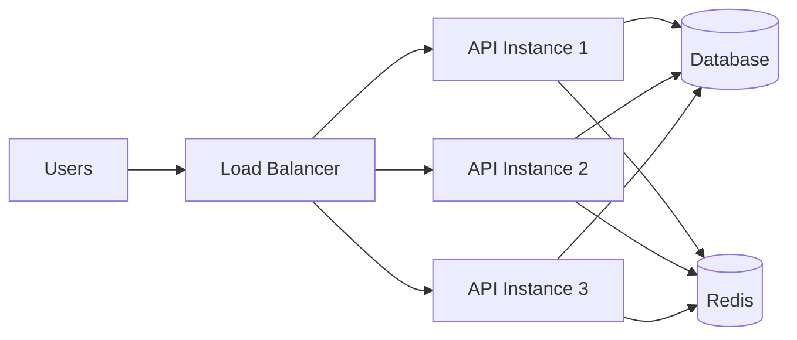
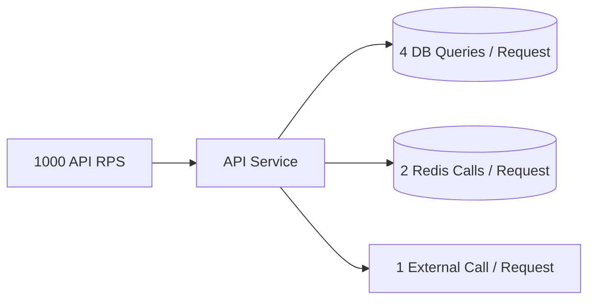
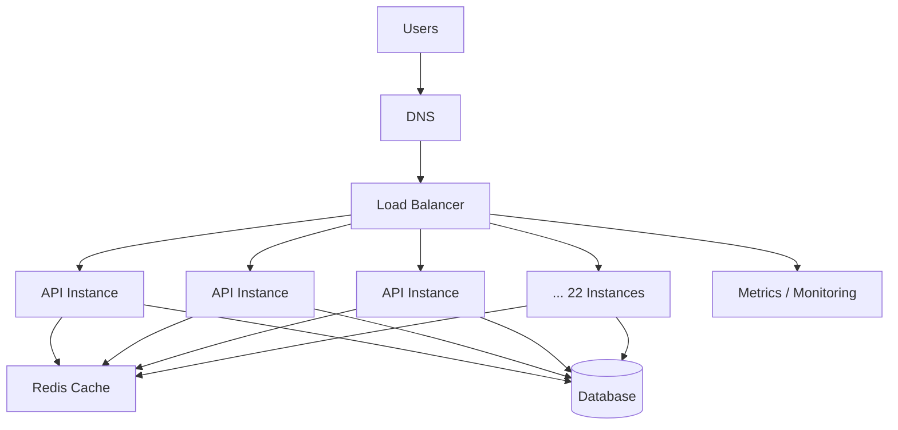
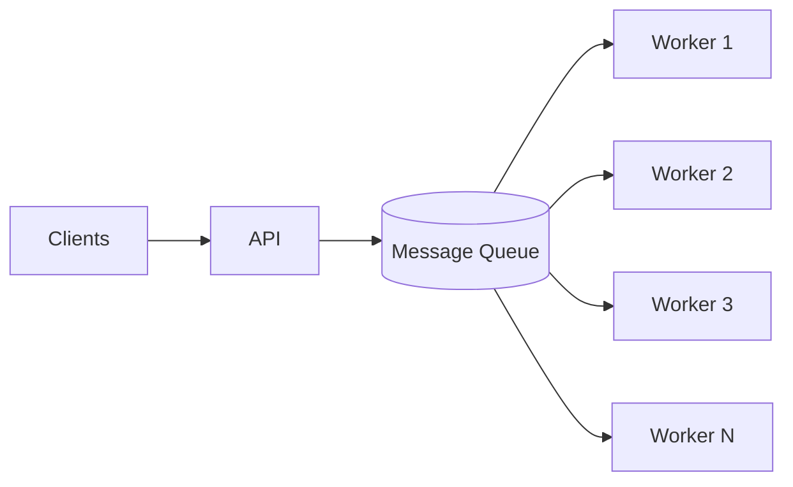
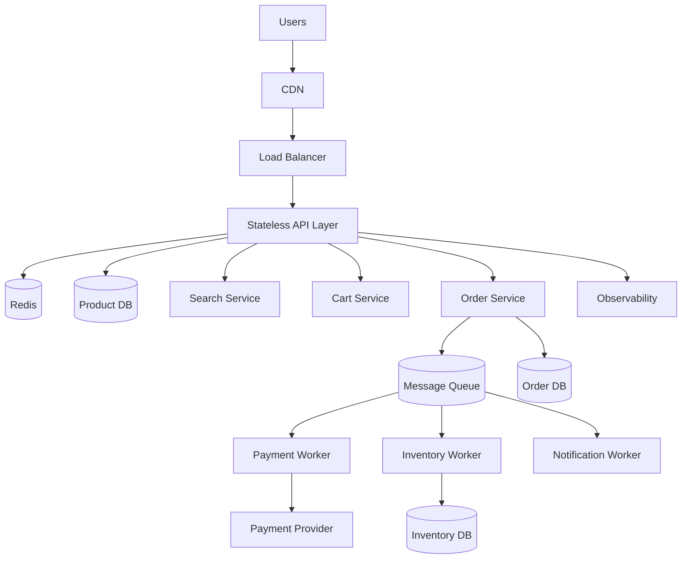
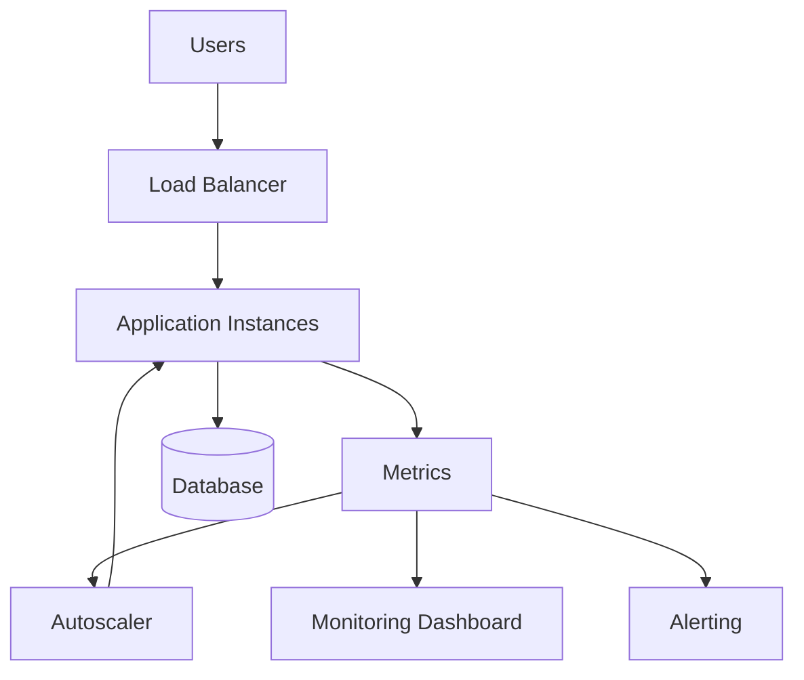

**SCALABILITY FUNDAMENTALS**

If Day 1 taught you how to think about a system and Day 2 taught you how architectural components fit together, Day 3 teaches you to answer the question:

“What happens when the number of users, requests, data, or traffic becomes 10×, 100×, or 1,000× larger?”

A system that works for 100 users is not necessarily a well-designed system. A system-design engineer must understand how capacity changes as demand changes, where bottlenecks appear, and what trade-offs are introduced when scaling.

__📚 Day 3 Learning Objectives__

By the end of Day 3, you should be able to:
```
Explain scalability in your own words.
Differentiate vertical, horizontal and diagonal scaling.
Understand scale up/down vs scale out/in.
Explain why stateless services scale more easily.
Understand stateful services and why they are harder to scale.
Calculate:
RPS
QPS
concurrent users
throughput
latency
bandwidth
Understand average, peak and burst traffic.
Calculate baseline and peak capacity.
Estimate future capacity using growth rates.
Understand headroom.
Identify bottlenecks.
Understand why simply adding servers doesn't always solve scalability.
Design a basic scalable architecture.
Reason about capacity before choosing infrastructure.
Understand how modern systems combine:
Load balancers
Horizontal scaling
Caching
Queues
Databases
Autoscaling
Stateless services
Capacity planning
```

**1. What Is Scalability?**

Scalability is the ability of a system to handle increasing workload by adding or adjusting resources while maintaining acceptable performance, reliability and cost.

Google describes scalability as the ability to adjust system capacity as workload changes.

Suppose you build:
```
Users
  ↓
Application Server
  ↓
Database
```
Initially:
```
100 users
   ↓
1 Server
   ↓
Database
```
Now users become:

10,000 users

The question becomes:

Can the architecture handle the additional workload?

If not, what do we change?
```
               ┌── Server 1
               │
Users → LB ────┼── Server 2
               │
               └── Server 3
                    ↓
                  DB
```
This is scalability.


**2. Scalability ≠ Performance**

This distinction is extremely important.

Performance - 

Performance asks:

How fast does my system perform a given amount of work?

Example:

API response = 100 ms

Scalability - 

Scalability asks:

What happens when workload increases?

Example:

100 RPS   → 100 ms
500 RPS   → 110 ms
1000 RPS  → 120 ms
5000 RPS  → 130 ms

This system is scaling reasonably well.

But:

100 RPS   → 100 ms
500 RPS   → 150 ms
1000 RPS  → 500 ms
5000 RPS  → 10 seconds

The system may have acceptable performance at low load but poor scalability.

**3. Scalability vs Elasticity**

These terms are related but different.

Scalability - 

Ability to handle increased workload by increasing capacity.

Elasticity - 

Ability to automatically adjust capacity according to demand.

For example:
```
Normal traffic
     ↓
3 instances

Traffic increases
     ↓
Autoscaler
     ↓
8 instances

Traffic decreases
     ↓
Autoscaler
     ↓
3 instances
```
Modern cloud architectures frequently combine scalability with autoscaling. Azure, for example, describes autoscaling as automatically adding/removing resources when conditions are met.


**4. The Three Major Scaling Strategies**

We have:
```
                  SCALING
                     │
        ┌────────────┼────────────┐
        ↓            ↓            ↓
     Vertical    Horizontal    Diagonal
      Scaling      Scaling       Scaling
```      
**5. Vertical Scaling**

Vertical scaling means increasing the capacity of an existing machine/resource.

Also called:

Scale Up
Scale Down

Example:

Before:
```
┌────────────────────┐
│ Server              │
│ 4 CPU               │
│ 8 GB RAM            │
└────────────────────┘

        ↓ SCALE UP

┌────────────────────┐
│ Server              │
│ 16 CPU              │
│ 64 GB RAM           │
└────────────────────┘
```
Microsoft defines vertical scaling as adding compute capacity to existing resources.

Real-world analogy - 

Imagine a restaurant.

Initially:

1 chef

Orders increase.

Instead of hiring additional chefs, you give the chef:

Better equipment + Bigger kitchen + Faster oven

That's vertical scaling.


**6. Example: Database Vertical Scaling**

Suppose:

Database Server

CPU = 4 cores
RAM = 16 GB
Storage = 500 GB

The database is struggling.

You upgrade:

CPU = 32 cores
RAM = 128 GB
Storage = 2 TB

Same database server.
```
             BEFORE
                │
          ┌───────────┐
          │ Database  │
          │ 4 CPU     │
          │ 16 GB RAM│
          └───────────┘
                │
             SCALE UP
                ↓
          ┌───────────┐
          │ Database  │
          │ 32 CPU    │
          │128 GB RAM │
          └───────────┘
```
          
**7. Advantages of Vertical Scaling**
1. Simple
No major architectural changes.

2. Easier application model
The application can continue treating the machine as one server.

3. Useful for stateful workloads
Databases often benefit from vertical scaling.

4. Lower operational complexity
Instead of managing:
10 machines
you may manage:
1 powerful machine


**8. Disadvantages of Vertical Scaling**
1. Hardware ceiling
Eventually:
```
8 CPU
↓
16 CPU
↓
32 CPU
↓
64 CPU
↓
?
```
There is always an upper limit.

2. Expensive
The cost of high-end machines can increase significantly.

3. Potential downtime
Depending on infrastructure, resizing may require restart or migration. Microsoft explicitly notes that vertical scaling can require restarts depending on the resource.

4. Single-machine failure
If your architecture remains:
```
Users
  ↓
One huge server
```
that server can remain a critical failure point.


**9. Horizontal Scaling**

Horizontal scaling means increasing capacity by adding more instances/machines.

Also called:

Scale Out
Scale In

AWS defines horizontal scaling as increasing capacity by adding computers to the system.

Example:

BEFORE
```
        Users
          │
          ↓
      ┌────────┐
      │ Server │
      └────────┘
```
Scale out:
```
             ┌────────┐
             │Server 1│
             └────────┘
                 ↑
                 │
Users → Load Balancer
                 │
                 ↓
             ┌────────┐
             │Server 2│
             └────────┘
                 │
             ┌────────┐
             │Server 3│
             └────────┘
```
             
**10. Restaurant Analogy**

Imagine:

1 chef

Orders increase.

Instead of making one chef work 10× faster:

Chef 1
Chef 2
Chef 3
Chef 4

Now work can be distributed.

That's horizontal scaling.


**11. Horizontal Scaling in Real Systems**

Typical architecture:
```
                    Internet
                       │
                       ↓
                ┌─────────────┐
                │Load Balancer│
                └──────┬──────┘
                       │
          ┌────────────┼────────────┐
          ↓            ↓            ↓
     ┌────────┐   ┌────────┐   ┌────────┐
     │App #1  │   │App #2  │   │App #3  │
     └────────┘   └────────┘   └────────┘
          │            │            │
          └────────────┼────────────┘
                       ↓
                  ┌──────────┐
                  │ Database │
                  └──────────┘
```
Any request can be handled by any application instance if the application is appropriately stateless.


**12. Horizontal Scaling Advantages**

Scalability
You can add more machines.

Availability
If one instance fails:

Server 1 ❌
Server 2 ✅
Server 3 ✅

Parallel processing
Work can be distributed.

Fault tolerance
Failures become less catastrophic.

Cloud friendliness
Modern cloud infrastructure heavily relies on horizontal scaling.

Google recommends horizontal scalability and stateless designs because instances can be added/removed without depending on local state.


**13. Horizontal Scaling Problems**

Horizontal scaling isn't magic.

You introduce distributed-system problems:

Network communication
Load balancing
Data consistency
Distributed transactions
Session management
Service discovery
Distributed caching
Observability
Deployment coordination

This is why system design becomes difficult.


**14. Vertical vs Horizontal Scaling**

Feature	                                    Vertical	                                     Horizontal

Also called	                                Scale Up	                                      Scale Out
Strategy	                                Bigger machine	                                More machines
Complexity	                                 Lower	                                          Higher
Upper limit	                              Hardware limit	                                  Much higher
Fault tolerance	                             Lower	                                          Higher
Distributed architecture	                  Not required                                	Usually required
Stateful systems	                          Often useful	                                  More difficult
Stateless services	                           Works	                                         Excellent
Cost flexibility	                       Can become expensive	                           Usually more flexible
Failure domain	                           Single machine	                                 Multiple machines


**15. Diagonal Scaling**

This is where real-world architectures become interesting.

Diagonal scaling combines vertical and horizontal scaling.

Instead of choosing:

ONLY vertical

or

ONLY horizontal

we use both.

Example:

Initial:

2 CPU
4 GB RAM
1 instance

Scale vertically:

8 CPU
32 GB RAM
1 instance

Then scale horizontally:

8 CPU
32 GB RAM
       ↓
Instance 1
Instance 2
Instance 3


**16. Diagonal Scaling Architecture**
```
                    Users
                      │
                      ↓
                Load Balancer
                      │
       ┌──────────────┼──────────────┐
       ↓              ↓              ↓
   ┌────────┐     ┌────────┐     ┌────────┐
   │16 CPU  │     │16 CPU  │     │16 CPU  │
   │64 GB   │     │64 GB   │     │64 GB   │
   └────────┘     └────────┘     └────────┘
```
Here:

Vertical → 16 CPU / 64 GB
Horizontal → 3 instances

This is common in production because pure horizontal scaling isn't always sufficient.


**17. Brainstorming Exercise #1**

Suppose you have:

1000 users
1 application server
8 CPU
16 GB RAM

Traffic increases to:

10,000 users

What would you do?

Don't immediately say:

Add more servers.

Think like a system designer.

Question 1
What resource is actually saturated?

CPU?
RAM?
Disk?
Network?
Database?
Connection pool?
Thread pool?

Question 2
What type of workload?

CPU-intensive?
I/O-intensive?
Database-heavy?
Network-heavy?

Question 3
Can the application run on multiple instances?

Question 4
Does the application maintain local state?

Question 5
Is the database capable of handling the increased traffic?

This is the beginning of capacity thinking.


**18. Stateless Services**

A stateless service does not depend on information stored locally in a particular application instance to process a request.

Google recommends stateless architectures because instances can be added, removed or restarted without losing required application state.


**19. Stateless Example**

Imagine:

GET /users/123

Request goes to:

Server 1

Server 1 queries:

Database

Now another request goes to:

Server 2

Server 2 can process it.

Why?

Because required state exists outside the server.
```
                 ┌──────────┐
                 │ Database │
                 └────▲─────┘
                      │
          ┌───────────┼───────────┐
          │           │           │
      Server 1    Server 2    Server 3
```
      
20. Stateless Architecture



The application instances don't own important persistent state.


**21. Why Statelessness Helps Scaling**

Suppose:

Server 1 dies.

If state was stored locally:

Session ❌
Cart ❌
Workflow ❌
Temporary state ❌

Problem.

But if state is externalized:

Server 1 ❌
Redis      ✅
Database   ✅
ObjectStore ✅

Server 2 can continue.

Google highlights this as a major benefit of stateless architecture: scaling, recovery, restarts and load balancing become easier.


**22. What Does "State" Mean?**

State is information required to understand the current condition of a process or user interaction.

Examples:

User session
Shopping cart
Authentication state
Workflow progress
Uploaded file metadata
Game state
Transaction state
WebSocket connection
Local cache


**23. Stateful Service**

A stateful service maintains important state that is associated with a particular instance or requires coordination/persistence to continue processing.

Example:
```
Client
   ↓
Server 1
   ↓
Session stored locally

Next request:

Client
   ↓
Server 2
```
Server 2 doesn't know the session.


**24. Stateful Problem**
```
                Load Balancer
                     │
            ┌────────┴────────┐
            ↓                 ↓
        Server 1           Server 2
            │                 │
        Session A          No Session
```
If the user moves from Server 1 → Server 2:

Session unavailable


**25. Solution #1 — Sticky Sessions**

Load balancer tries to send the same client to the same server.
```
User A
  │
  └──────────────→ Server 1
                     ↑
                     │
              Always route A
```
This is called:

Session Affinity / Sticky Sessions

But it has disadvantages.

If Server 1 becomes overloaded:

Server 1 ███████████
Server 2 ██
Server 3 ██

the load isn't evenly distributed.

Microsoft specifically warns that session affinity can limit scalability and introduce single points of failure.


**26. Solution #2 — Externalize State**

Better:
```
User
 ↓
Load Balancer
 ↓
Any Server
 ↓
Redis / Database
```
Example:
```
              ┌──────────┐
              │  Redis   │
              └────▲─────┘
                   │
      ┌────────────┼────────────┐
      │            │            │
   Server 1     Server 2     Server 3
```
Now:

Request 1 → Server 1
Request 2 → Server 3
Request 3 → Server 2

All can access the same state.

27. Stateless Doesn't Mean "No State"

This is an extremely important interview point.

A system can have state.

The distinction is:

Stateless application instance
Application server

doesn't own persistent client/session state.

Stateful system
Database
Redis
Kafka
Object storage

may obviously contain state.

So:

Statelessness usually means externalizing state rather than eliminating state.


**28. Stateful Systems Are Not Bad**

Never say:
Stateful systems are bad.

That's incorrect.

Databases are naturally stateful.

Examples:

PostgreSQL
MySQL
MongoDB
Redis
Kafka

The goal is:

Make components stateless where practical and isolate/manage unavoidable state carefully.

Google recommends exactly this approach: when services cannot be stateless, explicitly identify them as stateful and design around their scaling requirements.


**29. Scaling Stateful Systems**

Stateful scaling is much harder.

Example:
```
Application
    ↓
Database

Adding application servers:

Application 1
Application 2
Application 3
Application 4
        ↓
     Database
```
may not help if:

Database = bottleneck

Microsoft explicitly highlights this problem: adding web servers does not solve a database bottleneck.

This is one of the most important system-design lessons:

Always identify the bottleneck before scaling.


**30. Load Concepts**

Now we need to understand how to measure workload.

Important metrics:

Requests/sec
Queries/sec
Connections
Concurrent users
Throughput
Latency
Bandwidth


**31. Requests Per Second — RPS**

RPS means:

Number of requests received by a system per second.

Example:

10,000 requests
over
100 seconds

Therefore:

RPS = 10,000 / 100

RPS = 100

So:

100 requests/sec


**32. QPS — Queries Per Second**

QPS usually represents:

Number of queries processed per second.

For example:

API requests = 1,000 RPS

Each request executes:

5 database queries

Therefore approximately:

Database QPS = 1,000 × 5 = 5,000 QPS

This is extremely important.

One API request ≠ one database query.


**33. Request Amplification**

Suppose:

1000 API RPS

Each API request triggers:

4 DB queries
2 Redis calls
1 downstream API call

Then:

DB QPS      = 4,000
Redis QPS   = 2,000
External API= 1,000

Architecture:



This is called request amplification.
It is a crucial capacity-planning concept.


**34. Connections**

A connection is a communication channel between two endpoints.

Examples:

TCP connections
Database connections
HTTP connections
WebSocket connections
Redis connections

Suppose:

10,000 concurrent users

doesn't necessarily mean:

10,000 database connections

because applications generally use:

Connection pools

Example:
```
10,000 users
       ↓
Application
       ↓
100 DB connections
       ↓
Database
```

**35. Why Connections Matter**

A database may support only a certain number of concurrent connections.

Suppose:

DB max connections = 500

You have:

10 application instances

Each instance creates:

100 connections

Total:

10 × 100 = 1000 connections

Database:

Maximum = 500
Requested = 1000

Result:

Connection exhaustion

Adding more application servers could actually make the system worse.


**36. Concurrent Users**

Concurrent users means:

Users actively interacting with the system during a given period.

This is different from total users.

Example:

Registered users = 10 million

Daily active users = 2 million

Concurrent users = 50,000

Capacity planning often cares much more about:

Concurrent active workload

than total registered users.


**37. Throughput**

Throughput means:
Amount of work successfully processed per unit of time.

Examples:

10,000 requests/sec

or:

5 GB/sec

or:

100,000 messages/sec

Throughput is not always the same as RPS.

For example:

100 RPS

where each request transfers:

10 MB

means:

100 × 10 MB
=
1000 MB/sec
≈ 1 GB/sec


**38. Latency**

Latency means:
Time required to complete an operation or receive a response.

Example:

Request
  ↓
Server processing
  ↓
Response

Latency = 120 ms

Typical measurements:

Average latency
P50
P90
P95
P99
P99.9


**39. Why Average Latency Can Mislead**

Suppose 100 requests:

95 requests → 50 ms
5 requests  → 2000 ms

Average can hide the terrible tail.

This is why production systems often care about:

P50
P95
P99

Example:

P50 = 50 ms
P95 = 100 ms
P99 = 2000 ms

The median looks great.

But 1% of users experience 2 seconds.

At:

1,000,000 requests/day

1% means:

10,000 requests

So tail latency matters.


**40. Bandwidth**

Bandwidth represents:
The amount of data that can be transferred over a network per unit of time.

Usually:

Mbps
Gbps
TB/day

Example:

10,000 requests/sec

Each response:

100 KB

Bandwidth:

10,000 × 100 KB
=
1,000,000 KB/sec
≈ 1 GB/sec

So you need roughly:

8 Gbps

of payload bandwidth before considering protocol overhead and other traffic.


**41. The Relationship Between Load Metrics**

Consider:
```
Users
 ↓
Requests
 ↓
RPS
 ↓
Application processing
 ↓
DB Queries
 ↓
QPS
 ↓
Network traffic
 ↓
Bandwidth
```
Meanwhile:
```
Concurrency
     ↓
Number of in-flight requests
     ↓
Connections / threads / resources
```
And:
```
Latency
     ↓
How long each operation occupies resources
```

**42. Little's Law — Very Important**

For steady-state systems:

L = λ.W

Where:

L = average number of items in system
λ = arrival rate
W = average time in system

In system design terms:

Concurrency ≈ RPS × Latency

Example:

RPS = 1,000
Latency = 100 ms
       = 0.1 sec

Therefore:

Concurrency
= 1000 × 0.1
= 100

Approximately:

100 concurrent requests

This relationship is extremely useful during interviews.


**43. Example**

Suppose:

10,000 RPS
Average latency = 200 ms

Convert:

200 ms = 0.2 sec

Therefore:

Concurrency
= 10,000 × 0.2
= 2,000

So approximately:

2,000 requests

are in flight at any moment.


**44. Capacity Planning**

Capacity planning is the process of estimating the resources required to handle current and future workload while meeting performance, availability and cost objectives.

Microsoft recommends forecasting workload using actual usage patterns and considering limitations, while Google recommends accounting for historical trends, seasonal variations, spikes and business growth.


**45. Capacity Planning Questions**

Before designing infrastructure, ask:

How much traffic do we have?
How much traffic do we expect?
What is the peak?
What is the burst?
How fast are we growing?
How much capacity does one instance provide?
How much headroom do we need?
What happens if one instance fails?
What is the bottleneck?
How much will it cost?


**46. Average Traffic**

Suppose:

Requests/day = 8,640,000

Average RPS:

8,640,000
-------------
86,400 sec

= 100 RPS

So average traffic:

100 RPS

But don't stop here.


**47. Peak Traffic**

Suppose traffic normally is:

100 RPS

but during business hours:

500 RPS

Then:

Average = 100 RPS
Peak    = 500 RPS

Designing only for:

100 RPS

would be dangerous.


**48. Burst Traffic**

Burst traffic is a sudden short-lived increase.

Example:

Normal:

100 RPS

Suddenly:

Black Friday

Traffic becomes:

10,000 RPS

for 30 seconds.

Graphically:

RPS

10000 |              ███
      |              ███
      |              ███
  500 |       ███████████
      |████████████████████
  100 |████████████████████
      +----------------------
          Time →

Burst traffic is especially dangerous because scaling may take time.

**49. Average vs Peak vs Burst**

Type	                     Meaning
Average              	Normal workload
Peak	          Highest sustained expected workload
Burst	             Sudden short-duration spike

Example:

Average = 100 RPS
Peak    = 500 RPS
Burst   = 5,000 RPS

These are three different planning dimensions.


**50. Growth Rate**

Suppose:

Current traffic = 1,000 RPS
Annual growth = 30%

After one year:
1000 × 1.30 = 1300

After two years:
1300 × 1.30 = 1690

After three years:
1690 × 1.30 = 2197

So:
Year 0 → 1,000
Year 1 → 1,300
Year 2 → 1,690
Year 3 → 2,197

This is compound growth.


**51. Capacity Planning Formula**

A useful conceptual model:

RequiredCapacity = PeakLoad × GrowthFactor × Headroom

Suppose:

Peak = 10,000 RPS
Growth = 30%
Headroom = 30%

Then:

10,000 × 1.30 × 1.30

= 16,900 RPS

So you might target roughly:

17,000 RPS

capacity.

This isn't a universal production formula—real systems require workload testing and component-specific limits—but it is an excellent first-pass estimation model.


**52. Headroom**

Headroom means:

Unused capacity intentionally kept available to absorb unexpected load, failures and growth.

Suppose:

Current peak = 8,000 RPS
System capacity = 10,000 RPS

Headroom:

10,000 - 8,000
=
2,000 RPS

Percentage:

2000 / 10000
=
20%


**53. Why Headroom Matters**

Imagine:

Server capacity = 1000 RPS
Current load = 950 RPS

Looks fine.

But then:

Traffic + 10%

becomes:

1045 RPS

System overloaded.

Instead:

Capacity = 1500 RPS
Load = 1000 RPS

You have:

500 RPS

of headroom.


**54. Headroom Should Also Handle Failures**

Suppose:

5 servers

each can process:

1000 RPS

Total:

5000 RPS

Current peak:

3500 RPS

Seems okay.

But one server fails:

4 × 1000
=
4000 RPS

Still okay.

So your architecture has some failure headroom.

This leads to:

Capacity planning must consider failure scenarios, not just normal traffic.


**55. Capacity Planning — Full Example**

Let's design a hypothetical API.

Requirements:

Users = 1,000,000
Daily requests = 100,000,000
Peak multiplier = 5×
Annual growth = 30%
Headroom = 30%

Step 1 — Average RPS

There are:

86,400 seconds/day

Therefore:

100,000,000 / 86,400
≈ 1,157 RPS

Average:

≈ 1,157 RPS

Step 2 — Peak RPS

Peak multiplier:

5×

Therefore:

1,157 × 5
≈ 5,785 RPS

Step 3 — Growth

30% growth:

5,785 × 1.30
≈ 7,520 RPS

Step 4 — Headroom

30% headroom:

7,520 × 1.30
≈ 9,776 RPS

Target capacity:

≈ 10,000 RPS


**56. Instance Capacity**

Suppose load testing tells us:

1 application instance
=
500 RPS

Required instances:

10,000 / 500
=
20

So:

20 instances


**57. But We Need Failure Tolerance**

Suppose we want to tolerate:

2 instances failing

Then:

20 + 2
=
22 instances

Or more realistically, we could calculate capacity based on remaining healthy instances:

22 × 500
=
11,000 RPS

After 2 failures:

20 × 500
=
10,000 RPS

So the remaining fleet still meets target capacity.

58. Architecture



But now comes the next system-design question:
Can the database handle the resulting QPS ?


**59. Never Stop at Application Capacity**

Suppose:

10,000 API RPS

Each request performs:

5 database queries

Then:

DB QPS = 50,000

But database supports:

10,000 QPS

Your architecture fails.
```
             10,000 RPS
                  │
                  ↓
            20 API servers
                  │
                  ↓
             50,000 QPS
                  │
                  ↓
          ┌──────────────┐
          │   Database   │
          │ capacity     │
          │ 10,000 QPS   │
          └──────────────┘
                  ❌
```
This is why:

Scalability is end-to-end.


**60. Bottleneck Thinking**

When scaling, think:

Where is the bottleneck?

Potential bottlenecks:

CPU
RAM
Disk I/O
Network
Application threads
Connection pool
Database
Cache
Queue
External API
Load balancer
Storage

Architecture:
```
Client
  ↓
Load Balancer
  ↓
API
  ↓
Cache
  ↓
Database
  ↓
Storage
```
Any one of these can become the bottleneck.


**61. Bottleneck Example**

Suppose:

API capacity = 20,000 RPS
DB capacity  = 5,000 QPS

Increasing API instances:

10 → 20 → 50 → 100

doesn't necessarily improve overall throughput.

The database remains:

5,000 QPS

Therefore:

System capacity is often constrained by the weakest critical component.

This is a simplification—queues, caching, partitioning and workload characteristics can change the relationship—but it is an excellent first mental model.


**62. Queue as a Scaling Tool**

Suppose users generate:

10,000 events/sec

but processing capacity is:

5,000/sec

Instead of immediately failing:
```
Users
 ↓
API
 ↓
Queue
 ↓
Workers
```
The queue absorbs temporary bursts.



Workers can then scale based on:

Queue depth

Modern autoscaling guidance commonly uses workload-specific metrics such as requests/sec and queue depth rather than relying only on CPU.


**63. Burst Traffic Architecture**

A strong architecture for bursty workloads:
```
                         ┌─────────────┐
Users → Load Balancer → │ API Servers │
                         └──────┬──────┘
                                │
                                ↓
                          Message Queue
                                │
                    ┌───────────┼───────────┐
                    ↓           ↓           ↓
                 Worker 1    Worker 2    Worker N
                    │           │           │
                    └───────────┼───────────┘
                                ↓
                              DB
```
Why?

Because:

Incoming traffic

doesn't have to equal:

Processing rate

at every instant.

The queue absorbs temporary differences.


**64. Autoscaling**

Autoscaling means:

Automatically changing resource capacity according to workload.

Example:
```
CPU > 70%
     ↓
Add instances

CPU < 30%
     ↓
Remove instances
```
But CPU isn't always the best metric.

Better metrics can include:

RPS
Queue depth
Concurrent requests
Latency
CPU
Memory
DB connection utilization
Custom business metrics

Azure's current guidance similarly recommends workload-specific metrics such as CPU, RPS and queue depth depending on workload.


**65. Why CPU-Based Autoscaling Can Fail**

Imagine an I/O-bound API:

CPU = 30%

but:

DB connections = 100%

Autoscaler sees:

CPU < threshold

and doesn't add servers.

But users experience:

High latency

Therefore:

Scale based on the resource that represents actual capacity saturation.


**66. Scaling Down Is Also Important**

Scaling isn't only:

ADD

It is:

Scale Out
Scale In
Scale Up
Scale Down

Example:

09:00 → 5 instances
12:00 → 20 instances
15:00 → 25 instances
22:00 → 5 instances

This saves cost.

But scale-in creates challenges:

Active requests
Long-running tasks
Connections
In-flight messages
Local state
WebSocket sessions

A graceful shutdown strategy becomes important.

Microsoft specifically highlights long-running tasks as a scaling challenge because instances may be removed while work is still executing.


**67. Advanced Concept — Scale Units**

A large system shouldn't necessarily scale one server at a time.

You may define a scale unit.

Example:

100 API instances
+
2 queues
+
3 cache clusters
+
database capacity

represent one production capacity unit.

Microsoft's architecture guidance describes scale units as groups of components designed to scale together.

This becomes useful in very large architectures.


**68. Advanced Concept — Scaling Is Not Uniform**

Imagine:

API → Payment → Inventory → Notification

Traffic:

API            = 10,000 RPS
Payment        = 2,000 RPS
Inventory      = 5,000 RPS
Notification   = 10,000 events/sec

Don't scale every service equally.

Instead:

API          → 20 instances
Payment      → 8 instances
Inventory    → 12 instances
Notification → 15 workers

This is:

Independent / component-level scaling

Modular architectures make this much easier. Google recommends modular design so components can be scaled independently.


**69. Advanced Architecture — Scalable E-Commerce System**

Let's brainstorm from scratch.

Suppose we're building:

An e-commerce platform.

Initial requirements:

10 million registered users
1 million daily active users
100,000 concurrent users
20,000 peak API RPS
50,000 peak read operations/sec
5,000 orders/sec


**70. Step 1 — Identify Workload Types**

Not all traffic is equal.

We might have:

Product browsing       → Read-heavy
Search                 → Read-heavy + CPU
Cart                   → Read/write
Checkout               → Write-heavy
Payment                → External dependency
Order processing       → Async
Notifications          → Async
Analytics              → Batch/streaming

Immediately we can see:

Different workloads require different scaling strategies.


**71. Step 2 — Architecture**




**72. Why This Architecture Scales**

CDN
Reduces origin traffic.

Stateless API
Can horizontally scale.

Redis
Reduces database load.

Separate services
Allow independent scaling.

Queue
Absorbs bursts.

Workers
Can scale based on queue depth.

Separate databases
Prevent unrelated workloads from competing.


**73. Detailed Request Flow**

Suppose:

User opens product page

Flow:
```
User
 ↓
CDN
 ↓
Load Balancer
 ↓
Product API
 ↓
Redis?
 ├── HIT → Return
 └── MISS
       ↓
    Database
       ↓
    Redis
       ↓
    Return
```
This prevents every request from hitting the database.


**74. Checkout Flow**

Now checkout:
```
User
 ↓
Load Balancer
 ↓
Checkout Service
 ↓
Order DB
 ↓
Message Queue
 ├── Payment
 ├── Inventory
 └── Notification
```
Instead of doing:

Payment
+
Inventory
+
Email
+
SMS

synchronously inside the request.

This reduces request latency and allows independent processing.


**75. Brainstorming Exercise #2**

Imagine your application has:

1 million users
10,000 RPS

But latency suddenly increases from:

100 ms → 2 seconds

What would you investigate?

Don't immediately scale.

Think:

Application
CPU?
GC?
Thread pool?
Connection pool?
Database
QPS?
Slow queries?
Locks?
Connections?
Disk I/O?
Cache
Hit ratio?
Evictions?
Memory?
Network
Bandwidth?
Packet loss?
Latency?
Dependencies
External API?
Payment gateway?
Another microservice?
Traffic
Unexpected spike?
Bot traffic?
Retry storm?

This is how an experienced system designer thinks.


**76. The Retry Storm Problem**

Advanced scenario.

Suppose downstream service becomes slow.

Normal:

API → Service B

Service B latency increases.

Clients retry:
```
Request
 ↓
Service B ❌
 ↓
Retry
 ↓
Service B
 ↓
Retry
 ↓
Service B
```
Traffic might become:

10,000 RPS

→

30,000 RPS

because of retries.

This can make the downstream service even worse.

This is called a:

Retry storm / retry amplification

This is why scalability is closely related to resilience patterns, which we'll study later.


**77. A Better Capacity Model**

When designing a system, think in layers:
```
                USER LOAD
                   │
                   ↓
             Requests / sec
                   │
                   ↓
             API Capacity
                   │
                   ↓
          Internal amplification
                   │
             ┌─────┴─────┐
             ↓           ↓
           DB QPS      Cache QPS
             │
             ↓
        Storage I/O
```
Every layer needs capacity.


**78. Capacity Planning Checklist**

For every major component ask:

1. What is the workload?
2. What is average load?
3. What is peak load?
4. What is burst load?
5. What is expected growth?
6. What is capacity per instance?
7. What is the bottleneck?
8. What is the failure scenario?
9. What headroom is required?
10. Can it scale horizontally?
11. Can it scale vertically?
12. Can it autoscale?
13. What metric should trigger scaling?
14. What happens during scale-in?
15. What is the cost?

    
**79. Important Capacity Planning Formula Sheet**

Average RPS - 
Average RPS = Total Requests / Time Period

Peak RPS - 
Peak RPS = Average RPS X Peak Multiplier

Future Traffic - 
Future = Current X (1+GrowthRate) to the power y years

Required Capacity - 
Conceptually:
RequiredCapacity = PeakLoad X GrowthFactor X HeadroomFactor 

Number of Instances - 
Instances = RequiredCapacity / CapacityPerInstance

Round up, not down.

Database QPS - 
DB QPS = API RPS X DBQueriesPerRequest

Bandwidth - 
Bandwidth = Requests/sec X AveragePayloadSize

Concurrency - 
Using Little's Law:
Concurrency = RPS X Latency


**80. Example Calculation**

Given:

Peak RPS = 5,000

Each request:
3 DB queries
2 Redis queries

Response size = 200 KB

Average latency = 100 ms

One API instance = 250 RPS
API instances
5000 / 250
=
20

At minimum:

20 instances

Before additional failure/headroom requirements.

DB QPS
5000 × 3
=
15,000 QPS

Redis QPS
5000 × 2
=
10,000 QPS

Bandwidth
5000 × 200 KB
=
1,000,000 KB/sec
≈ 1 GB/sec

Concurrency
5000 × 0.1
=
500

Approximately:

500 concurrent requests

Now you have transformed vague requirements into measurable infrastructure requirements.

That is system design.


**81. Java Example — Stateless API**

The implementation language is not the focus, but Java is useful for seeing what stateless code looks like.
```
@RestController
@RequestMapping("/users")
public class UserController {

    private final UserService userService;

    public UserController(UserService userService) {
        this.userService = userService;
    }

    @GetMapping("/{id}")
    public UserResponse getUser(@PathVariable Long id) {
        return userService.getUser(id);
    }
}
```
The instance does not depend on:

static user sessions

or:

local persistent files

for the request to work.


**82. Bad Example — Local Session State**
```
private final Map<String, UserSession> sessions =
        new ConcurrentHashMap<>();
```
Imagine:

Server 1
sessions = A,B,C

Server 1 dies.

Sessions:

A,B,C → LOST

And another server doesn't have them.

A scalable architecture might instead use:
```
Application
     ↓
Redis
     ↓
Session state
```

**83. Java Pseudocode — Externalized Session**
```
public Session getSession(String sessionId) {

    return redis.get(sessionId);
}
```
Now:

Request → Instance 1
Request → Instance 3
Request → Instance 2

All instances can retrieve the same session.


**84. Simple Autoscaling Pseudocode**
```
if average_rps_per_instance > target_rps:
    add_instances()

if queue_depth > threshold:
    add_workers()

if average_rps_per_instance < lower_threshold:
    remove_instances()
```
Real production autoscaling is more sophisticated because you need:

cooldown periods
min instances
max instances
stabilization
health checks
scaling policies
rate limits
dependency limits


**85. Autoscaling Architecture**




**86. A Critical Real-World Lesson**

Suppose:

API instances = 10

Database:

Max connections = 500

Each instance:

Connection pool = 100

Total:

10 × 100 = 1000

You're already beyond database capacity.

Now autoscaling increases:

10 → 30 instances

Connections:

30 × 100
=
3,000

The autoscaler may actually accelerate failure.

Therefore:

Scaling one component can overload another component.

Microsoft explicitly recommends considering the order of scaling and downstream bottlenecks so that scaling an upstream component doesn't overload its dependencies.

This is a very important advanced system-design insight.


**87. The Scaling Chain**

Always visualize:
```
              SCALE
                │
                ↓
           API Servers
                │
                ↓
          Connection Pool
                │
                ↓
            Database
                │
                ↓
             Storage
```
Scaling must happen end-to-end.


**88. The Core Philosophy of Scalability**

You should start developing this mental model:
```
              DEMAND
                 │
                 ↓
       ┌─────────────────┐
       │ Measure Workload │
       └────────┬────────┘
                ↓
          Find Bottleneck
                ↓
       ┌────────┴────────┐
       ↓                 ↓
   Scale Up          Scale Out
       │                 │
       └────────┬────────┘
                ↓
        Externalize State
                ↓
         Distribute Load
                ↓
       Protect Dependencies
                ↓
          Add Headroom
                ↓
          Monitor Results
```
          
**89. Interview-Level Questions**\

Beginner

Q1. What is scalability?
Ability to handle increasing workload by increasing/adjusting capacity.

Q2. Vertical vs horizontal scaling?
Vertical → bigger machine.
Horizontal → more machines.

Q3. What is statelessness?
Instances don't depend on locally stored persistent state.

Intermediate

Q4. Why are stateless services easier to scale?
Any instance can generally process any request, making load balancing and adding/removing replicas easier.

Q5. Why are databases harder to scale horizontally?
They maintain state and require data distribution, consistency and coordination.

Q6. What is RPS?
Requests processed/received per second.

Q7. What is QPS?
Queries processed per second, commonly used for database/search/storage workloads.

Advanced

Q8. If you have 10,000 RPS, how many servers do you need?
You cannot answer without knowing:

capacity/server
latency target
workload
CPU
memory
dependencies
headroom
failure requirements

Q9. What happens if you horizontally scale API servers but database is the bottleneck?
The database remains the limiting factor and additional API instances may increase DB pressure.

Q10. What metric would you use for autoscaling?
Depends on workload:

CPU
RPS
latency
queue depth
concurrent requests
custom business metric


**90. System Design Interview Brainstorming Framework**

Whenever the interviewer says:

"Design YouTube."

Don't immediately draw:

API
Database
Cache

Start with workload.

Step 1 — Users
How many users?
Step 2 — Traffic
Requests/day?
Average RPS?
Peak RPS?
Step 3 — Data
Average object size?
Storage growth?
Step 4 — Read/write ratio
90% reads?
10% writes?
Step 5 — Capacity
What can one instance handle?
Step 6 — Scaling
Vertical?
Horizontal?
Both?
Step 7 — Bottlenecks
DB?
Network?
Storage?
CPU?
Step 8 — Resilience
What happens when something fails?
Step 9 — Future growth
How does traffic grow?

91. Master Architecture

```mermaid
flowchart TB

    USERS[Users / Clients]
    
    USERS --> DNS[DNS]
    DNS --> CDN[CDN]
    CDN --> LB[Load Balancer]

    LB --> API1[Stateless API]
    LB --> API2[Stateless API]
    LB --> API3[Stateless API]
    LB --> APIN[More Replicas]

    API1 --> CACHE[(Distributed Cache)]
    API2 --> CACHE
    API3 --> CACHE
    APIN --> CACHE

    API1 --> DB[(Database)]
    API2 --> DB
    API3 --> DB
    APIN --> DB

    API1 --> Q[(Message Queue)]
    API2 --> Q
    API3 --> Q
    APIN --> Q

    Q --> W1[Worker 1]
    Q --> W2[Worker 2]
    Q --> W3[Worker N]

    W1 --> DB
    W2 --> DB
    W3 --> DB

    API1 --> METRICS[Metrics]
    API2 --> METRICS
    API3 --> METRICS
    W1 --> METRICS

    METRICS --> AUTO[Autoscaler]

    AUTO --> API1
    AUTO --> W1
```



This architecture demonstrates almost everything from today's lesson:

Horizontal scaling
Stateless services
Load balancing
Caching
Queues
Independent workers
Capacity planning
Autoscaling
Database bottleneck awareness
Observability


**92. Mental Model**

Remember this:
```
                 SCALABILITY
                      │
       ┌──────────────┼───────────────┐
       ↓              ↓               ↓
    Scale Up       Scale Out       Diagonal
       │              │               │
   Bigger VM      More VMs       Both
                      │
                      ↓
                 Statelessness
                      │
                      ↓
                Load Balancing
                      │
                      ↓
              Measure Workload
                      │
        ┌─────────────┼─────────────┐
        ↓             ↓             ↓
      RPS/QPS     Concurrency    Bandwidth
        │             │             │
        └─────────────┼─────────────┘
                      ↓
                Capacity Planning
                      │
       ┌──────────────┼──────────────┐
       ↓              ↓              ↓
    Average          Peak           Burst
                      │
                      ↓
                 Growth Rate
                      │
                      ↓
                  Headroom
                      │
                      ↓
                 Find Bottleneck
                      │
                      ↓
               Scale intelligently
```

93. Key Takeaways

If you remember only 15 things from Day 3, remember these:

Scalability = ability to handle increasing workload.
Performance and scalability are related but different.
Vertical scaling = bigger machine.
Horizontal scaling = more machines.
Diagonal scaling = combination.
Horizontal scaling works especially well with stateless services.
Stateless doesn't mean the system has no state.
Externalize important state to databases/cache/storage.
RPS measures requests per second.
QPS measures queries per second.
Throughput measures work completed per unit time.
Latency measures time taken.
Concurrent requests are related to RPS × latency.
Capacity planning must consider average, peak, burst and growth.
Never scale blindly—find the bottleneck first.


**94. Recommended Genuine Resources**

[Google Cloud — Patterns for scalable and resilient apps](https://docs.cloud.google.com/architecture/scalable-and-resilient-apps?utm_source=chatgpt.com) - Excellent for understanding scalability, statelessness and resilient architectures.

[Google Cloud — Horizontal scalability](https://docs.cloud.google.com/architecture/framework/reliability/horizontal-scalability?utm_source=chatgpt.com) - https://docs.cloud.google.com/architecture/framework/reliability/horizontal-scalability?utm_source=chatgpt.com

[Google Cloud — Traffic and load management](https://docs.cloud.google.com/architecture/infra-reliability-guide/traffic-load?utm_source=chatgpt.com) - Particularly useful for capacity planning and forecasting workload.

[Microsoft Azure — Scaling strategy](https://learn.microsoft.com/en-us/azure/well-architected/reliability/scaling?utm_source=chatgpt.com) - Very useful for understanding vertical/horizontal scaling, statelessness, bottlenecks and downstream dependencies.

[Microsoft Azure — Capacity planning](https://learn.microsoft.com/en-us/azure/well-architected/performance-efficiency/capacity-planning?utm_source=chatgpt.com) - Useful for practical capacity-planning concepts.

[AWS Well-Architected — Horizontal scaling](https://wa.aws.amazon.com/wellarchitected/2020-07-02T19-33-23/wat.concept.horizontal-scaling.en.html?utm_source=chatgpt.com) - A concise explanation of horizontal vs vertical scaling.

[AWS — Reliable scalability](https://aws.amazon.com/blogs/architecture/architecting-for-reliable-scalability/?utm_source=chatgpt.com) - Useful for understanding stateless horizontal architectures and distributed scaling.


🧠 Final Challenge — Don't Look at the Answer Immediately

Imagine you're building:

A food-delivery application

Requirements:

5 million daily users
500,000 concurrent users
100 million API requests/day
Peak traffic = 5× average
Traffic growth = 40%/year

Your task is to brainstorm:

1. What is average RPS?
2. What is peak RPS?
3. What infrastructure would you scale horizontally?
4. What would you scale vertically?
5. Which services should be stateless?
6. Where would state live?
7. What happens if traffic suddenly becomes 10×?
8. Which component is likely to become the bottleneck?
9. Would you use a queue?
10. What metric would trigger autoscaling?
11. How much headroom would you maintain?
12. What happens if one-third of your servers fail?
13. What happens if the database cannot scale at the same rate?
14. What happens if a restaurant-order event takes 5 seconds to process?
15. What happens if clients start retrying every failed request?

Don't think about technologies first.

Think:

WORKLOAD
   ↓
CAPACITY
   ↓
BOTTLENECK
   ↓
SCALING STRATEGY
   ↓
STATE
   ↓
FAILURE
   ↓
TRADE-OFF

That thinking process is far more valuable than memorizing definitions.

🔥 Day 3's Core Philosophy

A system does not become scalable simply because you add more servers.

A genuinely scalable architecture understands:
```
                    DEMAND
                       ↓
              Measure the workload
                       ↓
              Estimate the capacity
                       ↓
              Identify bottlenecks
                       ↓
           ┌───────────┴───────────┐
           ↓                       ↓
       Scale Up                 Scale Out
           │                       │
           └───────────┬───────────┘
                       ↓
                 Externalize State
                       ↓
                  Distribute Load
                       ↓
                 Protect Dependencies
                       ↓
                    Headroom
                       ↓
                   Failures
                       ↓
                 Future Growth
                       ↓
              Cost / Performance
                       ↓
                Sustainable System
```
This is the mindset you should carry into every system-design problem from now on.

And one important principle to carry forward into Day 4:

Before you scale a component, understand what is limiting it—and what downstream component you might break by scaling it.
