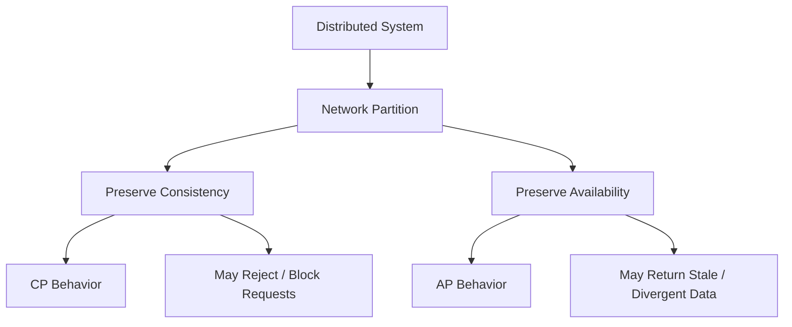
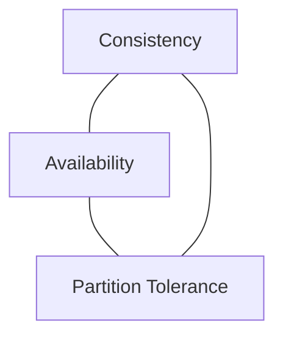
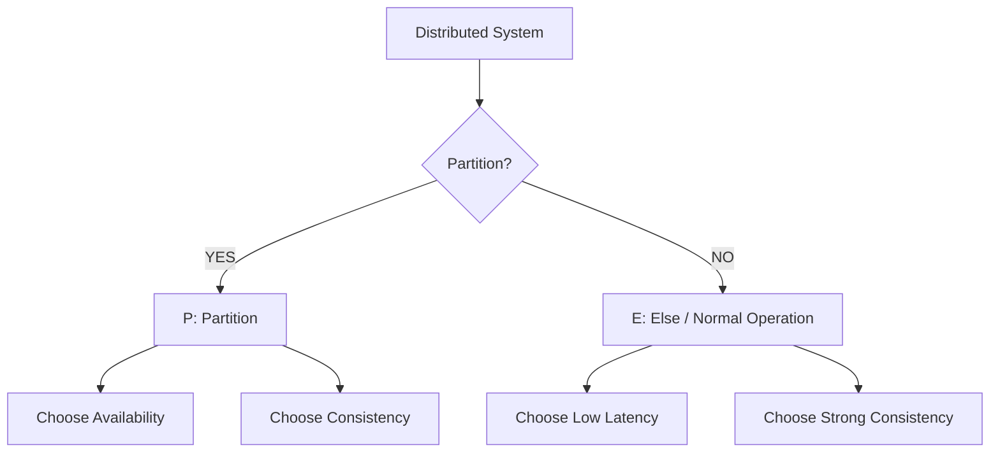
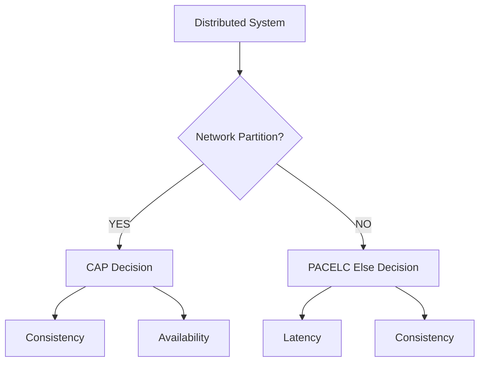
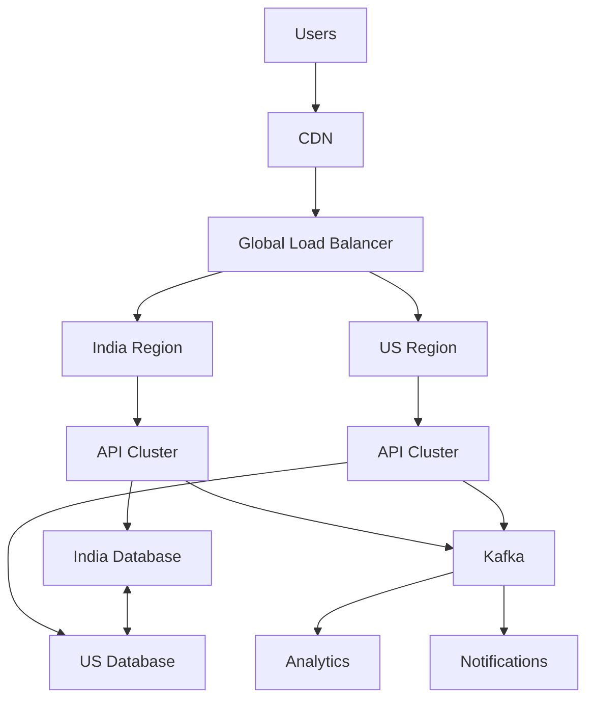
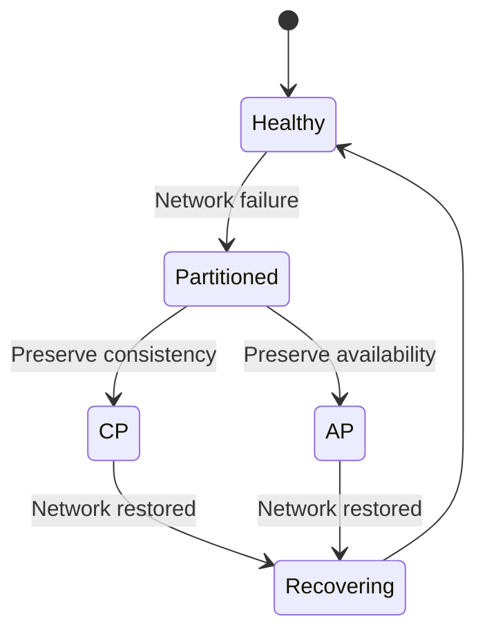
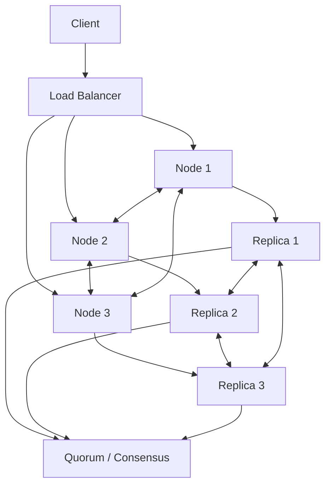
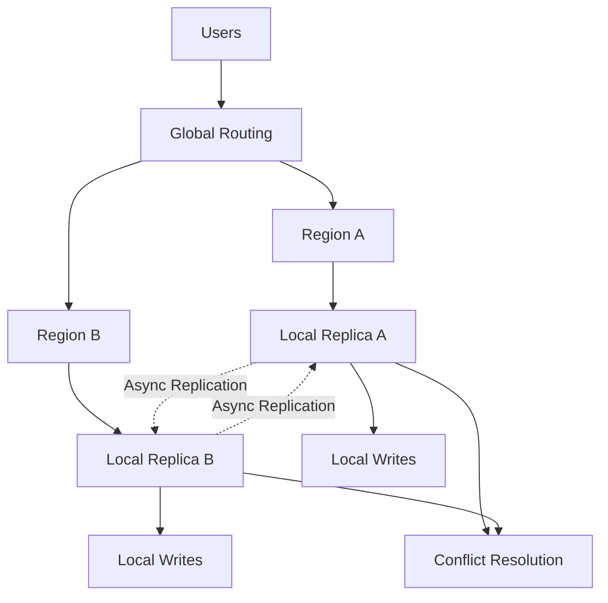
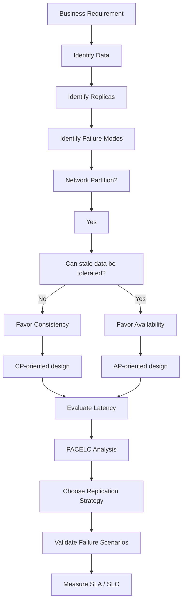

CAP is not “pick any two.” In a real distributed system, network partitions are a failure condition you generally must tolerate.
Therefore, when a partition happens, the practical trade-off is primarily between Consistency and Availability.

__Learning Objectives__

By the end of Day 4, you should be able to:
```
Explain what a distributed system is.
Explain why distributed systems are fundamentally difficult.
Understand distributed state.
Understand network partitions.
Understand different failure models.
Define:
Consistency
Availability
Partition Tolerance
Explain CAP theorem without using the misleading "pick any two" interpretation.
Understand why Partition Tolerance is generally not optional in real distributed systems.
Understand the difference between:
Strong consistency
Eventual consistency
Availability
Fault tolerance
Analyze a distributed system during a network partition.
Understand CP, AP and the limitations of the CA terminology.
Understand CAP through real-world scenarios.
Understand quorum-based systems.
Understand how replication creates CAP trade-offs.
Understand PACELC.
Understand why latency vs consistency matters even when there is no failure.
Reason about CAP/PACELC during system-design interviews.
Apply CAP/PACELC to databases, caches, messaging systems and multi-region architectures.
```


**1. Why Are We Studying CAP?**

Before CAP, imagine a very simple application.
```
                 ┌─────────────┐
User ───────────►│ Application │
                 └──────┬──────┘
                        │
                        ▼
                 ┌─────────────┐
                 │  Database   │
                 └─────────────┘
```
There is one database.

If the application writes:

balance = $100

and immediately reads it:

balance = $100

there is no distributed synchronization problem.

Now suppose the application grows.

We deploy databases in multiple locations:
```
                 ┌─────────────┐
                 │ Application │
                 └──────┬──────┘
                        │
              ┌─────────┴─────────┐
              ▼                   ▼
       ┌────────────┐       ┌────────────┐
       │ Database A │◄─────►│ Database B │
       │   India    │       │  Europe    │
       └────────────┘       └────────────┘
```
Now we have a new problem:

What happens if Database A and Database B cannot communicate?

That single question leads us directly into CAP.


__2. What Is a Distributed System?__

A distributed system is a collection of independent computers that cooperate over a network to provide a unified service.

Examples:

- Distributed databases
- Kafka clusters
- Kubernetes clusters
- Microservices
- Cloud applications
- Multi-region applications
- Distributed caches
- Search clusters
- Object storage
- Payment systems


A simplified architecture:
```
                    Internet
                       │
              ┌────────┴────────┐
              │ Load Balancer   │
              └────────┬────────┘
                       │
          ┌────────────┼────────────┐
          ▼            ▼            ▼
       Server A     Server B     Server C
          │            │            │
          └────────────┼────────────┘
                       │
                Distributed DB
             ┌─────────┼─────────┐
             ▼         ▼         ▼
           Node A    Node B    Node C
```
The important word is:

Network

The nodes need the network to coordinate.

And networks can:
- Delay messages
- Drop messages
- Duplicate messages
- Reorder messages
- Disconnect nodes
- Become congested
- Become partially unavailable
- Fail between regions

This is where distributed systems become difficult.


**3. The Fundamental Distributed Systems Problem**

Consider two replicas.
```
        Replica A                 Replica B

       balance=100               balance=100
            │                         │
            │                         │
            └──────── Network ─────────┘
```
Client sends:

SET balance = 50

to Replica A.

Replica A updates:

balance = 50

But before Replica A can replicate the change:
A network partition occured between Node A and Node B
```
             X
            / \
           /   \
          A     B

      balance   balance
        50        100
```
Now another user reads from B.

They receive:

balance = 100

But another user reading A gets:

balance = 50

We now have:

Distributed state divergence

This is the heart of many distributed-systems problems.


**4. What Is Distributed State?**

State means information that the system remembers.

Examples:
- User balance
- Order status
- Inventory quantity
- Shopping cart
- Session information
- Payment status
- Account permissions
- Message offsets
- Configuration

In a distributed system, the same logical state may exist on multiple nodes.
```
                 Logical State
                       │
          ┌────────────┼────────────┐
          ▼            ▼            ▼
       Replica A    Replica B    Replica C

       balance=100  balance=100  balance=100
```
The challenge is:

How do we ensure that all replicas have an acceptable view of the same logical state?

There are several possible answers.

Option 1 — Synchronous replication

Don't acknowledge the write until replicas agree.
```
Client
  │
  ▼
Node A
  │
  ├────────► Node B
  │             │
  ├────────► Node C
  │             │
  ◄─────────────┘
  │
  ▼
ACK
```
Advantages:

- Stronger consistency

Disadvantages:

- Higher latency
- Network failure can prevent progress
- Availability can decrease

Option 2 — Asynchronous replication

Acknowledge immediately.
```
Client
  │
  ▼
Node A
  │
  ▼
ACK
  │
  ├────────► Node B
  └────────► Node C
```
Advantages:

- Lower latency
- Higher availability

Disadvantages:

- Replicas can temporarily disagree
- Reads can return stale data
- Replication lag can occur
- Failures can cause lost/uncommitted updates depending on design

This is where CAP/PACELC becomes important.


**5. Network Partition**

A network partition occurs when communicating nodes become unable to reliably communicate with each other.

Example:

              Network
                 X
                / \
               /   \
              /     \
        ┌─────┐     ┌─────┐
        │ A   │     │ B   │
        │     │     │     │
        └─────┘     └─────┘

Node A is alive.

Node B is alive.

But:
```
A ─────X───── B
```
Messages cannot successfully travel between them.

This is extremely important:

A network partition does not necessarily mean the machines are dead.

Both machines may be perfectly healthy.

The communication path is broken.


**6. Real-World Partition Examples**

A partition can happen because of:

- Router failure
- Network switch failure
- Firewall rule
- DNS failure
- Cloud networking problem
- Availability Zone failure
- Region connectivity failure
- Cable failure
- Packet loss
- Network congestion
- Kubernetes networking problem
- Service discovery failure
- Security policy
- Misconfiguration

Example:
```
                Internet
                   │
          ┌────────┴────────┐
          │                 │
       Region A          Region B
          │                 │
       DB Node A         DB Node B
          │                 │
          └───────X─────────┘
```
Both regions are operational.

But they cannot communicate.

This is a partition.


**7. Failure Model**

Before designing a distributed system, we need to ask:

What failures are we assuming can happen?

This is called the failure model.

Typical failures include:

7.1 Crash failure

A node stops responding.
```
Node A ──X
```
7.2 Network failure

Messages cannot reach another node.
```
A ─────X───── B
```
7.3 Message delay

Message eventually arrives but very late.
```
A ────────────────► B
     10 seconds
```
The system may have already assumed:

B is dead

when it was actually just slow.

7.4 Message loss
```
A ───────X──────► B
```
The message never arrives.

7.5 Message duplication

A request may arrive more than once.
```
A ───────► B
A ───────► B
```
This is why distributed systems often require:

- Idempotency
- Request IDs
- Deduplication
- Exactly-once-like processing semantics at the application level

7.6 Message reordering

Suppose:

Message 1 = balance = 100

Message 2 = balance = 50

Network delivers:

Message 2

Message 1

Replica might incorrectly end up with:

balance = 100

instead of:

balance = 50

Distributed systems therefore need mechanisms such as:

 - Sequence numbers
 - Logical clocks
 - Version numbers
 - Timestamps
 - Consensus protocols
 - Conflict resolution


**8. CAP Theorem**

CAP stands for:

- C = Consistency
- A = Availability
- P = Partition Tolerance

The formal result was developed from Eric Brewer's conjecture and formally proved by Seth Gilbert and Nancy Lynch in 2002. The formal result concerns an asynchronous distributed system and establishes that strong consistency and availability cannot both be guaranteed when network partitions are possible.

The simplified statement is:

A distributed system cannot simultaneously guarantee strong consistency, availability, and partition tolerance under the CAP model.

But don't memorize that sentence alone.

You need to understand why.


**9. CAP — Consistency**

CAP's "Consistency" should not be confused with general database consistency from ACID.

In CAP discussions, consistency is generally referring to strong/atomic consistency, commonly understood as linearizability.

Simplified:

Once a successful write completes, every subsequent read should see that write or a newer value.

Example:

Initial:

balance = 100

Client A:

SET balance = 50

Write succeeds.

Client B immediately reads:

GET balance

Strong consistency requires:

50

not:

100


**10. CAP Consistency Example**

Imagine bank account:

Account A

Balance = ₹10,000

Two ATM systems:
```
ATM 1 ─────► Database A
ATM 2 ─────► Database B
```
If Database A says:

₹10,000

and Database B says:

₹10,000

then:

ATM 1 withdraw ₹8,000

Database A becomes:

₹2,000

But if Database B hasn't received the update yet:

Database B = ₹10,000

ATM 2 might allow another:

₹8,000 withdrawal

Now the system has potentially allowed:

₹16,000 withdrawal

from:

₹10,000

This is why consistency matters for certain workloads.


**11. CAP — Availability**

CAP availability means:

Every request to a non-failing node receives a response within the required model's bounds, rather than being indefinitely rejected or waiting forever.

Simplified:
```
Request
   │
   ▼
System
   │
   ▼
Response
```
Even if some nodes are unreachable, the system continues responding according to its availability guarantee.

Example:
```
Node A   Node B   Node C
  ✓        X        ✓
```
An available system might still process a request through A or C.


**12. Important: Availability ≠ Uptime**

Don't confuse:

Availability

with:

"Server is online"

In distributed systems, availability is about whether requests can receive acceptable responses.

A service could have:

Server = technically running

but:

Request = timeout

From the user's perspective:

System = unavailable

Availability is therefore an end-to-end property, not merely a machine being powered on.

AWS also distinguishes availability from reliability and provides quantitative measures such as MTBF and MTTR for system availability.


**13. CAP — Partition Tolerance**

Partition tolerance means:

The system continues to operate despite communication failures that divide the distributed nodes.

Example:
```
           NETWORK PARTITION

     ┌─────────────┐
     │             │
     │   Region A   │
     │   DB A       │
     │             │
     └──────┬──────┘
            X
            X
            X
     ┌──────┴──────┐
     │             │
     │   Region B   │
     │   DB B       │
     │             │
     └─────────────┘
```
Partition tolerance asks:

Can the architecture survive this communication failure?


**14. The Most Important CAP Insight**

This is where many developers misunderstand CAP.

People often say:

Choose 2:

C    A    P

This is misleading.

The better mental model is:
```
                    NORMAL OPERATION
                          │
                          ▼
                  C + A can coexist
                          │
                          ▼
                 NETWORK PARTITION
                          │
                  ┌───────┴───────┐
                  ▼               ▼
              Consistency    Availability
                  │               │
                CP              AP
```
Why?

Because Partition Tolerance isn't usually something you voluntarily "choose to turn on."

If your system spans:

- Multiple machines
- Availability zones
- Regions
- Data centers
- Internet-connected services

then communication failures are unavoidable possibilities.

AWS explicitly notes that most distributed systems need to tolerate network failures, making the practical choice during a partition a trade-off between consistency and availability.


**15. Why Can't We Have C + A + P?**

Let's reason instead of memorizing.

Consider:
```
            Client 1
               │
               ▼
             Node A
               │
               X
               X   PARTITION
               X
             Node B
               ▲
               │
            Client 2
```
Initially:

A = 100

B = 100

Client 1 writes:

A = 50

But partition prevents:

A ─────X───── B

So now:

A = 50

B = 100

Client 2 asks B:

GET balance

What should B return?

Choice 1 — Return 100

Then B is available.

But:

A = 50

B = 100

The system cannot guarantee strong consistency.

So:

Availability ✓
Partition Tolerance ✓
Strong Consistency ✗

This is AP behavior.

Choice 2 — Refuse the request

B says:

"I cannot confirm the latest state."

Then consistency can be preserved.

But the request does not receive the desired successful response.

So:

Consistency ✓
Partition Tolerance ✓
Availability ✗

This is CP behavior.


**16. CAP Visual Model**




**17. CAP Triangle**



But interpret it carefully.

A better interview diagram is:
```
                 Partition
                    │
                    │
          ┌─────────┴─────────┐
          │                   │
          ▼                   ▼
    Consistency          Availability
       CP                     AP
```
The partition is the event that forces the trade-off.


**18. CP Systems**

CP means:

Consistency + Partition Tolerance

During a partition:

Consistency > Availability

The system prefers correctness over serving potentially conflicting data.

Example behavior:
```
Client
  │
  ▼
Node B
  │
  │ Cannot communicate with quorum
  │
  ▼
Reject / Retry / Wait
```
The system may say:

- 503
- Retry
- Unavailable
- Not enough replicas

The key idea:

Better to fail than return incorrect data.


**19. Where CP Makes Sense**

CP-style behavior is useful for:

- Banking transactions
- Inventory reservation
- Distributed locks
- Leader election
- Critical configuration
- Unique username allocation
- Financial ledger operations
- Strong authorization state
- Certain metadata systems

Example:

Available inventory = 1

Two customers attempt:

Customer A → Buy

Customer B → Buy

You probably don't want:

Customer A → SUCCESS

Customer B → SUCCESS

for the same single item.

You may prefer:

Customer A → SUCCESS

Customer B → RETRY / FAILURE

This sacrifices availability for correctness.


**20. AP Systems**

AP means:

Availability + Partition Tolerance

During a partition:

Availability > Immediate Strong Consistency

The system continues serving requests.

Different replicas may temporarily contain different values.

Replica A = 50

Replica B = 100

After the partition heals:
```
       Replication
            │
            ▼
    Conflict Resolution
            │
            ▼
       Converged State
```
This is commonly associated with eventual consistency or other relaxed consistency models.

**21. Where AP Makes Sense**

AP-style behavior may be appropriate for:

- Social media feeds
- Product recommendations
- Likes
- View counts
- Analytics
- Shopping carts in some designs
- DNS-like distributed information
- Content delivery
- User activity feeds
- Non-critical counters

Suppose:

Instagram-like post

likes = 1,000,000

If a user sees:

999,998

instead of:

1,000,000

for a short period, the business may accept that.

But if a bank account shows:

₹10,000

instead of:

₹2,000

that is a very different problem.

**22. CA — The Important Nuance**

You will hear:

CA = Consistency + Availability

But be careful.

CAP's partition condition is exactly what makes the trade-off relevant.

A system that does not need to tolerate partitions can theoretically provide:

C + A

For example:

Application
     │
     ▼
Single Database

There is no replica-to-replica partition to reason about.

However:

Database crashes

and you lose availability.

Therefore, calling real large-scale distributed systems simply "CA" can be misleading.

In practice:

For systems that must survive network partitions, the meaningful CAP discussion is usually CP vs AP behavior during partition.

**23. CAP Decision Table**

| System Type | Consistency | Availability | Partition Tolerance | Behavior During Partition |
|-------------|-------------|--------------|---------------------|---------------------------|
| **CP** | ✓ Strong | ✗ Reduced | ✓ Yes | Prioritizes consistency; may reject/delay requests |
| **AP** | ✗ Relaxed | ✓ High | ✓ Yes | Prioritizes availability; may return stale data |
| **CA*** | ✓ Strong | ✓ High | ✗ No | Works only when network partitions do not occur |

* CA is mainly meaningful when partition tolerance is not required.

24. CAP Does NOT Mean "The System Is Always Inconsistent"

This is another common misconception.

An AP system does not necessarily mean:

Data is always wrong.

Instead:
```
Normal operation
      │
      ▼
Replicas synchronized
      │
      ▼
Partition occurs
      │
      ▼
Temporary divergence
      │
      ▼
Partition heals
      │
      ▼
Replication / reconciliation
      │
      ▼
Convergence
```
This is why:

Eventual consistency does not mean permanent inconsistency.

It means replicas may temporarily disagree but are expected to converge if updates stop and communication is restored, subject to the system's consistency model and conflict-resolution rules.

**25. CAP and Replication**

Replication is one of the major reasons CAP becomes relevant.

Suppose:
```
                Primary
                   │
          ┌────────┼────────┐
          ▼        ▼        ▼
       Replica1 Replica2 Replica3
```
A write can be handled in multiple ways.

Synchronous
```
Write
 │
 ▼
Primary
 │
 ├──► Replica1
 ├──► Replica2
 └──► Replica3
 │
 ▼
ACK
```
- Higher consistency.

Potentially:

- Higher latency
- Lower availability during failures

Asynchronous
  
Write
 │
 ▼
Primary
 │
 ▼
ACK
 │
 ├────► Replica1
 ├────► Replica2
 └────► Replica3

- Lower latency.

Potentially:

- Replication lag
- Stale reads
- Divergence

This connects directly to PACELC.

**26. Quorum**

A common distributed-system technique is quorum.

Suppose:

N = 3 replicas

We can use:

W = write quorum

R = read quorum

A common configuration:

N = 3

W = 2

R = 2

Then:

W + R > N

because:

2 + 2 > 3

Therefore, read and write sets overlap.

**27. Quorum Diagram**
```
            N = 3

          ┌───────┐
          │Node A │
          └───────┘
          ┌───────┐
          │Node B │
          └───────┘
          ┌───────┐
          │Node C │
          └───────┘
```
Write quorum:

A + B

Read quorum:

B + C

Intersection: B

This can help provide strong read/write guarantees under appropriate assumptions.

But:

Quorum is not magic.

You still need to reason about:

- Failure detection
- Network partitions
- Conflict resolution
- Versioning
- Leader election
- Stale replicas
- Read repair
- Write repair
- Membership changes

  
**28. Simple Quorum Pseudocode**
```
write(key, value):

    successfulWrites = 0

    for replica in replicas:
        if replica.write(key, value):
            successfulWrites++

    if successfulWrites >= WRITE_QUORUM:
        return SUCCESS

    return FAILURE

Read:

read(key):

    responses = []

    for replica in replicas:
        response = replica.read(key)

        if response exists:
            responses.add(response)

    if responses.size >= READ_QUORUM:

        latest = resolveLatest(responses)

        return latest

    return FAILURE
```
In production systems, this is substantially more complicated because of timeouts, partial failures, retries, version vectors, conflict resolution, hinted handoff, read repair, and other mechanisms.

29. Java-Like Quorum Example
```
public Result write(String key, String value) {

    int success = 0;

    for (Replica replica : replicas) {

        try {
            replica.write(key, value);
            success++;

        } catch (TimeoutException ex) {
            // Replica unavailable
        }
    }

    if (success >= writeQuorum) {
        return Result.SUCCESS;
    }

    return Result.FAILURE;
}
```
The important part isn't the Java syntax.

The system-design idea is:

How many replicas must acknowledge before I tell the client:

"Your write succeeded"?


**30. Network Partition Scenario — Interview Thinking**

Suppose you are designing:

Global Payment Service

Architecture:
```
                  Global Users
                       │
              ┌────────┴────────┐
              │ Global LB       │
              └────────┬────────┘
                       │
        ┌──────────────┴──────────────┐
        ▼                             ▼
   Region India                  Region US
        │                             │
   Payment DB                    Payment DB
```
Now ask yourself:

What happens if India and US lose connectivity?

Don't immediately answer "CP."

Start brainstorming.


**31. Brainstorming Framework**

Always ask:

Question 1

What data are we protecting?

- Payment amount
- Payment status
- Account balance
- Transaction ID

Question 2

Can the same transaction be processed twice?

NO

Question 3

Can stale data cause financial loss?

YES

Question 4

Can we reject requests during a partition?

Possibly

Question 5

Which is worse?

Temporary payment failure OR Double charge

Usually:

Double charge

is worse.

Therefore:

Favor consistency

This leads toward CP-style behavior for critical transactional state.


**32. Different Scenario — Social Feed**

Now design:

Social Media Feed

Partition occurs.

Ask:

Can users tolerate slightly stale feed data?

Probably yes.

Ask:

Can the system continue showing cached/replicated content?

Probably yes.

Ask:

Is showing an old post worse than rejecting the entire feed?

Usually no.

Therefore:

Favor Availability

This leads toward AP-style behavior for appropriate parts of the system.


**33. CAP Is Usually Per Data / Operation**

This is an advanced but extremely important idea.

Don't say:

"Our entire application is AP."

Instead ask:

"Which component and which data access path has which consistency requirement?"

For example:

E-commerce System

Product Catalog

  → AP-ish

Product Reviews

  → AP-ish

Recommendation Engine

  → AP

Inventory Reservation

  → Strong consistency

Payment Ledger

  → Strong consistency

Analytics

  → Eventual consistency

One architecture can therefore contain different consistency strategies.


**34. CAP Is a Design Decision, Not a Database Label**

Avoid saying:

Database X = AP

Database Y = CP

without understanding its configuration and workload.

A distributed database may support multiple consistency modes.

You should instead ask:

- What consistency model?
- What replication topology?
- What quorum?
- What failure mode?
- What read/write policy?
- What happens during partition?

The answer determines the actual behavior.


**35. Consistency Spectrum**

Consistency is not simply:

Consistent OR Inconsistent

There is a spectrum.
```
Weak
 │
 ├── Eventual Consistency
 │
 ├── Read Your Writes
 │
 ├── Monotonic Reads
 │
 ├── Causal Consistency
 │
 ├── Sequential Consistency
 │
 └── Linearizability
Strong
```
You will study these in much greater depth in later distributed-systems topics.

For Day 4, remember:

CAP's C is about a strong consistency guarantee, not every possible meaning of "consistency."


**36. Strong Consistency**

Suppose:

WRITE X = 10

returns:

SUCCESS

Then:

READ X

should return:

10

or a newer value.

Not:

5


**37. Eventual Consistency**

Suppose:

Node A = 10

Node B = 5

After replication:

Node B = 10

The system eventually converges.

Timeline:

t0:

A = 5

B = 5

t1:

Write A = 10

t2:

A = 10

B = 5

t3:

Replication

t4:

A = 10

B = 10

The window:

t2 → t3

is the period of inconsistency.


**38. CAP vs ACID**

Do not confuse: CAP with ACID

ACID:

- Atomicity
- Consistency
- Isolation
- Durability

CAP:

- Consistency
- Availability
- Partition Tolerance

They answer different questions.

ACID asks:

What transactional guarantees does a database provide?

CAP asks:

What guarantees can a distributed system maintain when network partitions occur?


**39. CAP vs Horizontal Scaling**

Horizontal scaling:
```
        Load Balancer
        /     |      \
       A      B       C
```
does not automatically mean CAP becomes your immediate problem.

If:

A/B/C are stateless application servers, then a load balancer can distribute traffic without requiring those servers to maintain replicated application state.

CAP becomes especially important when distributed state must remain coordinated.

Example:
```
Stateless APIs
     │
     ▼
Distributed Database
     │
     ▼
Replication
```
The database/state layer is where CAP becomes central.


**40. CAP and Microservices**

Microservices do not eliminate CAP.

They often increase the number of distributed interactions.

Example:
```
Order Service
      │
      ├────► Payment Service
      │
      ├────► Inventory Service
      │
      └────► Notification Service
```
Each service may have:

- Different database
- Different availability
- Different consistency
- Different failure modes

Now imagine:

- Payment succeeds
- Inventory fails

You cannot simply assume a global transaction is always available.

This leads later to:

- Saga
- Outbox Pattern
- Eventual Consistency
- Idempotency
- Distributed Transactions
- Compensation
- Transactional Messaging

These are future topics, but CAP is the conceptual foundation.


**41. CAP and Distributed Transactions**

Suppose:

- Order DB
- Payment DB
- Inventory DB

You want:

ALL SUCCESS OR ALL ROLLBACK

In a distributed system:
```
Order Service
      │
      ├────► Payment
      │
      └────► Inventory
```
Network failure can occur between any components.
```
Order ─────X──── Payment
```
Now the system must decide:

- Wait?
- Retry?
- Rollback?
- Compensate?
- Return failure?
- Continue?

This is why distributed transactions are difficult.

CAP is one of the foundational ideas explaining these trade-offs.


**42. PACELC**

CAP primarily describes the trade-off that occurs when a partition happens.

But ask:

What happens 99.99% of the time when there is NO partition?

CAP doesn't fully describe the normal-operation trade-off.

This motivates:
```
PACELC
P = Partition
A = Availability
C = Consistency

E = Else
L = Latency
C = Consistency
```
The principle is:

IF Partition:

   Availability vs Consistency

ELSE:

  Latency vs Consistency

PACELC was proposed by Daniel Abadi to extend CAP's reasoning to normal operation, where replication still creates a consistency-versus-latency trade-off.


**43. PACELC Diagram**




**44. Why Does Latency vs Consistency Exist?**

Imagine:
```
Client
  │
  ▼
Region A
  │
  ▼
Database A

Replica:

Region B
  │
  ▼
Database B
```
Suppose a write occurs in Region A.

To guarantee strong consistency, you may need:
```
Region A
   │
   ├──────► Region B
   │
   │   ACK
   ◄───────┘
   │
   ▼
Client
```
The client now waits for cross-region communication.

Therefore:
```
Strong consistency
        ↓
More coordination
        ↓
Higher latency
```
Alternatively:
```
Region A
   │
   ▼
ACK immediately
   │
   ├──────► Region B asynchronously
```
Then:
```
Lower latency
        ↓
Possible stale data
```
This is the "ELC" portion of PACELC.

AWS's multi-region guidance explicitly highlights the unavoidable latency introduced by geographic distance and the resulting trade-offs among latency, availability and consistency.


**45. PACELC Real-World Example**

Imagine:
```
India User
     │
     ▼
India Region
     │
     ▼
India DB

USA User
     │
     ▼
USA Region
     │
     ▼
USA DB
```
Strategy A — Synchronous replication

India DB:
```
WRITE
 │
 ├────► USA DB
 │
 ◄──── ACK
 │
 ▼
SUCCESS
```
Advantages:

- Stronger consistency

Disadvantage:

- Higher latency
  
Strategy B — Asynchronous replication

India DB:
```
WRITE
 │
 ▼
SUCCESS
 │
 └────► USA DB
```
Advantages:

- Lower latency

Disadvantage:

- Temporary stale state


**46. PACELC Classification**

A useful mental model is:

| System Preference | During Partition | Normal Operation |
|---|---|---|
| **CP + EC** | Consistency | Consistency |
| **CP + EL** | Consistency | Low Latency |
| **AP + EC** | Availability | Consistency |
| **AP + EL** | Availability | Low Latency |

Where:

- PC = Partition + Consistency
- PA = Partition + Availability

- EC = Else + Consistency
- EL = Else + Latency

Do not obsess over assigning products to these labels yet.

The important skill is understanding the design preference.


**47. PACELC Example — Global User Profile**

Suppose:

User profile:

name = Jay

city = Noida

You have:

India DB

US DB

Europe DB

A user updates:

city = Delhi

Should every region know immediately?

If yes:

Consistency ↑ Latency ↑

If no:

Latency ↓ Temporary staleness ↑

Now suppose there is a partition.

India X US

Do you:

Reject writes

or:

Continue accepting writes locally

Now PACELC gives you a structured way to reason about both situations.


**48. CAP vs PACELC**

| **CAP** | **PACELC** |
|---|---|
| Focuses on partition scenarios | Covers partition + normal operation |
| C vs A during P | A vs C during P |
| Does not focus on normal-operation latency trade-off | L vs C during Else |
| Excellent foundational theorem | More practical design lens |
| Failure-focused | Failure + normal-operation focused |

Think:

CAP:

"What happens when things break?"

PACELC:

"What happens when things break, and what trade-off are we making when everything is working normally?"


**50. The Most Important PACELC Insight**

Suppose your system has:

99.999% normal operation

0.001% partition

CAP primarily talks about:

0.001%

PACELC forces you to think about:

99.999%

During normal operation:

Do we want:

Fast response OR Stronger coordination?

This is extremely relevant in:

- Multi-region systems
- Global databases
- Distributed caches
- Replicated databases
- Geo-distributed services
- Global configuration
- Event-driven systems


**50. CAP + PACELC Combined Mental Model**



Remember:
```
                    PARTITION?
                       │
              ┌────────┴────────┐
             YES               NO
              │                 │
              ▼                 ▼
           CAP/PAC           PACELC
              │                 │
          A vs C             L vs C
```


**51. Detailed Distributed Architecture**

Let's design a global e-commerce platform.



Now start asking questions.


**52. Brainstorming This Architecture**

Step 1 — Identify state

What is distributed?

- Orders
- Inventory
- Payments
- Users
- Recommendations
- Analytics

Step 2 — Classify importance

Payment Ledger -> HIGH consistency

Inventory Reservation -> HIGH consistency

User Profile -> MEDIUM

Recommendations -> LOW

Analytics -> EVENTUAL

Step 3 — Identify failure

Suppose:

India X US

Step 4 — Ask business question

For each workload:

- Can it continue without US?
- Can it continue without India?
- Can stale data cause financial loss?
- Can requests be rejected?
- Can operations be retried?
- Can conflicts be merged?
  
Step 5 — Choose consistency model

Example:

Payment -> Strong consistency

Inventory -> Strong consistency

Product catalog -> Eventual consistency acceptable

Recommendations -> Eventual consistency

Analytics -> Eventual consistency

This is much more realistic than:

"Our whole application is CP."


**53. Failure Scenario**

Suppose:

India DB:

inventory = 1

US DB:

inventory = 1

Partition occurs.

India X US

Two users:

User A → India

User B → US

Both attempt to purchase.

If both regions independently accept:

User A → SUCCESS

User B → SUCCESS

then:

inventory = -1

or the physical item may be oversold.

This is an availability-oriented choice.


**54. CP Solution**

During partition:

India cannot obtain required coordination

Therefore:

India → Reject reservation

US:

US → Reject reservation

The system may temporarily become unavailable for that operation.

But:

No overselling

This is a consistency-first strategy.


**55. AP Solution**

During partition:

India accepts local reservation

US accepts local reservation

Then after partition:

India:

inventory = 0

US:

inventory = 0

But globally:

2 reservations
1 item

Now conflict resolution is needed.

Possible solutions:

- Compensation
- Refund
- Order cancellation
- Inventory reconciliation
- Priority rules
- Region ownership

This demonstrates an important point:

AP does not eliminate the problem. It moves the problem from synchronous coordination to conflict resolution.


**56. CAP Design Trade-Off Matrix**

| **Requirement** | **Prefer** |
|---|---|
| Financial correctness | Consistency |
| No overselling | Consistency |
| Distributed lock | Consistency |
| Always show something | Availability |
| Social feed | Availability |
| Recommendations | Availability |
| Analytics | Availability / Eventual Consistency |
| Global low latency | Low Latency |
| Global strong reads | Consistency |


**57. Another Important Concept — Coordination**

The more replicas need to coordinate, the more expensive distributed operations become.
```
No coordination
     │
     ▼
Very fast
     │
     ▼
Potentially stale

versus:

More coordination
     │
     ▼
More network communication
     │
     ▼
Higher latency
     │
     ▼
Stronger consistency
```
This is one of the central philosophies of distributed-system design.


**58. Distributed Systems Philosophy**

A powerful mental model:
```
Local operation
       │
       ▼
Fast
       │
       ▼
Distributed operation
       │
       ▼
Network involved
       │
       ▼
Network can fail
       │
       ▼
Coordination becomes expensive
       │
       ▼
Trade-offs appear
```
Therefore:

Distributed systems are fundamentally about managing uncertainty, failure, coordination and trade-offs.


**59. CAP Interview Question**

Explain CAP theorem.

Weak answer:

CAP says you can choose two of consistency, availability and partition tolerance.

Strong answer:

CAP states that in an asynchronous distributed system, strong consistency and availability cannot both be guaranteed when network partitions occur. Since partitions are a realistic failure mode for distributed systems, the practical decision is generally whether the system should favor consistency or availability during a partition. CP systems may reject or delay operations to preserve consistency, while AP systems continue serving requests and may temporarily expose divergent or stale state.

That is a much stronger system-design answer.


**60. Interview Follow-Ups**

Ques. Why can't we simply choose CA?

Answer:

CAP becomes relevant specifically because communication failures can partition a distributed system. If the system must tolerate such partitions, it cannot guarantee both strong consistency and availability during the partition. A CA design is therefore only meaningful when partition tolerance is not part of the required failure model, such as a non-replicated or otherwise partition-insensitive setup.

Ques. Is MongoDB CP or AP?

Don't answer immediately.

Ask:

- Which version?
- Which deployment?
- Which read concern?
- Which write concern?
- Which topology?
- What failure?
- What operation?

The correct system-design approach is to analyze the guarantees/configuration rather than blindly assigning one CAP label.

Ques. Is eventual consistency bad?

Answer:

No. Eventual consistency is a deliberate trade-off. It can provide lower latency and higher availability, especially for workloads where temporary staleness is acceptable. The important question is whether stale or conflicting data is acceptable for the business operation.

Ques. Give an AP example.

Possible answer:

A social feed can often tolerate temporarily stale data. During a network partition, continuing to serve cached or locally replicated content may be more valuable than rejecting the request. The system can reconcile or converge later.

Ques. Give a CP example.

Possible answer:

A distributed inventory reservation system may favor consistency because allowing two regions to independently reserve the last item can result in overselling. During a partition, it may reject or pause reservations instead of accepting potentially conflicting writes.

Ques. What does PACELC add to CAP?

Strong answer:

CAP describes the fundamental trade-off during a network partition: availability versus consistency. PACELC extends this reasoning to normal operation: if there is no partition, a replicated system may still have to trade latency against consistency because stronger coordination often requires additional network round trips.


**61. Advanced Concept — CAP Is About Guarantees**

A system can sometimes provide:

Strong consistency

during normal operation.

But when partition occurs:

Strong consistency + availability

cannot both be guaranteed under the CAP model.

Therefore distinguish:

Normal-state behavior

from:

Failure-state behavior

This is critical.


**62. Normal vs Failure State**




**63. Advanced Concept — Partial Failure**

In a distributed system:

System = 10 nodes

It is possible that:
```
Node 1 ✓
Node 2 ✓
Node 3 ✓
Node 4 ✗
Node 5 ✓
Node 6 ✓
Node 7 ✗
Node 8 ✓
Node 9 ✓
Node 10 ✓
```
The system is not simply:

UP or DOWN

It can be:

PARTIALLY FAILED

This is called a partial failure problem.

Distributed systems are difficult precisely because different components can have different views of what is happening.


**64. The "Slow Node" Problem**

Suppose:

*Node A *Node B *Node C

A request is sent to all three.

A → 10ms

B → 20ms

C → 30 seconds

Is C:

Dead?

Maybe.

Or:

Slow?

Maybe.

This uncertainty is fundamental.

A distributed system often cannot instantly know:

"The node is definitely dead."

It can only infer:

"I haven't heard from the node within my timeout."

This affects:

- Failure detection
- Consensus
- Quorum
- Leader election
- Availability
- Consistency

  
**65. Why Timeouts Matter**

Suppose:

timeout = 100ms

But network occasionally needs:

150ms

You may falsely classify healthy nodes as unavailable.

If timeout is:

30 seconds

you may wait too long before failing over.

Therefore:
```
Timeout selection
        ↓
Failure detection
        ↓
Availability
        ↓
Consistency behavior
```
Everything is connected.


**66. Advanced Architecture — CP-Oriented System**



During partition:

If quorum unavailable:

  reject write OR reject strong read

Goal:

Prevent conflicting state


**67. Advanced Architecture — AP-Oriented System**



During partition:

Region A continues

Region B continues

Later:

Reconciliation -> Conflict Resolution -> Convergence


**68. CAP Brainstorming Template**

Whenever you encounter a new system, write:

1. What state is distributed?

2. How many replicas exist?

3. Why are replicas needed?

4. What happens if replicas cannot communicate?

5. What happens if one replica crashes?

6. What happens if a message is delayed?

7. Can requests continue during a partition?

8. If yes, can stale data be tolerated?

9. If no, what consistency guarantee are we protecting?

10. What is worse: stale data or rejected request?

11. What is the business impact?

12. Can conflicts be resolved later?

13. What latency is acceptable?

14. How far apart are replicas geographically?

15. Do we require synchronous replication?

16. Can asynchronous replication work?

17. What happens after recovery?

18. How do replicas converge?

19. What consistency model do reads require?

20. What consistency model do writes require?

This checklist should become second nature.


**69. CAP Design Workflow**




**70. CAP Decision Framework**

Don't ask:

"Should I choose CP or AP?"

Instead ask:

What does the business require?

For every important operation:
```
Consistency requirement
        ↓
Availability requirement
        ↓
Latency requirement
        ↓
Partition behavior
        ↓
Replication strategy
        ↓
Conflict strategy
```


**71. Real-World Scenario — Banking**

Requirement

Transfer ₹50,000

What if the network partitions?

India Bank DB X US Bank DB

Can both sides accept independent transfers?

Potentially dangerous.

Why?

- Double spending
- Incorrect balances
- Incorrect ledger

Therefore:

Consistency is extremely important.

Possible design:
```
Strongly coordinated ledger
+
Quorum / consensus
+
Idempotency
+
Audit log
+
Retry
```


**72. Real-World Scenario — Netflix-Like Recommendations**

Suppose:

Recommended Movies

Partition occurs.

Would you rather:

Return yesterday's recommendations

or:

Return HTTP 503

Usually:

Yesterday's recommendations

Therefore:

Availability > perfect freshness

AP/eventual consistency is reasonable for that subsystem.


**73. Real-World Scenario — Product Catalog**

Suppose:

Product: IPhone 17

Price: ₹79,999

A price update happens.

Should every user globally see the new price immediately?

Depends.

For:

Display catalog

some temporary staleness may be acceptable.

For:

Final checkout price

you probably need stronger guarantees.

Therefore:

Catalog read:

Eventually consistent

Checkout validation:

Strongly validated

This demonstrates why consistency requirements are often operation-specific.


**74. Real-World Scenario — Social Likes**

Suppose:

Like count = 10,000

Two regions receive:

Region A -> +1

Region B -> +1

During partition:

Region A = 10,001
Region B = 10,001

Later:

10,002

This can often be handled with:

Eventual consistency
+
Idempotent events
+
Conflict-free aggregation

The system doesn't need to stop serving users just because replicas temporarily disagree.


**75. CAP and Business Requirements**

A system designer must translate:

Technical requirement

from:

Business requirement

Example:

Business says:

"The website should always be available."

You should ask:

- Does "always" include payment?
- Does "always" include inventory reservation?
- Does "always" include recommendations?
- Does "always" include profile updates?

The answer may be:

- Homepage → available
- Catalog → available
- Recommendations → available
- Checkout → temporarily unavailable if correctness cannot be guaranteed

This is mature system design.


**76. Important Mental Model**

Never design:

Database first

Design:
```
Requirement
     ↓
Consistency requirement
     ↓
Failure model
     ↓
Availability requirement
     ↓
Latency requirement
     ↓
Architecture
     ↓
Technology
```
Technology comes later.


**77. CAP + PACELC Summary**

CAP - When Partition occurs :
```
       Availability
             ↕
       Consistency
```

PACELC - If Partition : 
```
       Availability
             ↕
       Consistency
```
Else:
```
          Latency
             ↕
       Consistency
```


**78. Day-4 Advanced Takeaways**

You should now understand:
```
Distributed systems
        ↓
Distributed state
        ↓
Replication
        ↓
Network communication
        ↓
Partial failure
        ↓
Network partition
        ↓
CAP
        ↓
Consistency vs Availability
        ↓
PACELC
        ↓
Latency vs Consistency
```
This chain is more important than memorizing definitions.


**79. Day-4 Mental Model**

Remember this:
```
                     DISTRIBUTED SYSTEM
                            │
                            ▼
                     Multiple Nodes
                            │
                            ▼
                     Shared State
                            │
                            ▼
                     Replication
                            │
                            ▼
                    Network Required
                            │
                            ▼
                    Network Can Fail
                            │
                            ▼
                    Network Partition
                       /          \
                      /            \
                     ▼              ▼
              Consistency      Availability
                   CP               AP

            Normal Operation
                    │
                    ▼
             PACELC: L vs C
```


**80. Practical Exercise #1**

Design:

Food Delivery Application

Components:
```
User Service
Restaurant Service
Order Service
Payment Service
Inventory Service
```
Imagine:

Region India X Region US

For each service decide:

CP-oriented OR AP-oriented

But don't answer based on intuition.

For every service ask:
```
1. What state does it own?
2. What happens if stale data is returned?
3. What happens if a request is rejected?
4. What happens if two regions accept conflicting writes?
5. Can the conflict be resolved?
6. What latency is acceptable?
```

   
**81. Practical Exercise #2**

Design a:

Global Inventory System

Requirements:
```
100 million products
10 million users
5 regions
99.99% availability
Low latency
No overselling
```
Now you have a conflict.

You want:
```
High availability
+
Low latency
+
Strong consistency
+
Partition tolerance
```
Ask yourself:

Can I guarantee all of these simultaneously during a partition?

This is exactly the kind of question CAP is designed to make you think about.


82. Practical Exercise #3

Design:

Global Social Media Like Counter

Requirements:
```
High availability
Low latency
Millions of writes/sec
Temporary inconsistency acceptable
```
Now think:

Would I block a user because another region cannot be contacted?

Probably not.

Then ask:
```
How will I reconcile?
How will I prevent duplicate events?
How will I converge?
```
This naturally leads to:
```
AP
+
Eventual Consistency
+
Idempotency
+
Asynchronous Replication
```


83. Day-4 Homework

Before moving to Day 5, solve these without looking at the answers.

Problem 1

Design a distributed bank balance system.

Determine:

- Consistency?
- Availability?
- Partition behavior?
- Replication?

Problem 2

Design WhatsApp-like message delivery.

Think about:

- Message ordering
- Duplicate messages
- Offline users
- Availability
- Eventual consistency
- Network partitions
  
Problem 3

Design Amazon-like inventory.

Think about:

- Stock = 1
- Two users
- Two regions
- Network partition

What happens?

Problem 4

Design YouTube view counting.

Suppose:

100 million views/day

Do you need every replica to immediately agree?

Why or why not?

Problem 5

Design a global user-profile service.

Compare:

Strong consistency vs Eventual consistency

Calculate the conceptual impact on:

- Latency
- Availability
- Replication
- Failure handling

  
84. Day-4 Interview Checklist

You should be able to answer "yes" to all of these:
```
What is a distributed system?
What is distributed state?
What is replication?
What is a network partition?
What is partial failure?
What is a failure model?
What is CAP?
What does CAP's C actually mean?
What does CAP's A actually mean?
What is P?
Why is P generally unavoidable?
Why isn't CAP simply "pick two"?
What is CP?
What is AP?
Why is CA terminology potentially misleading?
What is eventual consistency?
What is strong consistency?
What is quorum?
Why does replication create latency?
What is PACELC?
What does the E in PACELC mean?
What is L?
Why does strong consistency increase latency?
How does CAP affect multi-region architecture?
How does CAP affect microservices?
How do business requirements determine consistency?
Can different parts of one application use different consistency models?
```


**85. Recommended Reading & References**

1. AWS — CAP Theorem

Excellent practical explanation from AWS covering consistency, availability and partition tolerance.

AWS's guidance emphasizes that distributed systems generally need to tolerate network failures, making the consistency-vs-availability decision especially relevant during partitions.

[AWS — CAP Theorem](https://docs.aws.amazon.com/whitepapers/latest/availability-and-beyond-improving-resilience/cap-theorem.html?utm_source=chatgpt.com)

2. AWS — Distributed System Availability

Useful for understanding availability, redundancy, MTBF, MTTR and fault tolerance.

[AWS — Understanding Availability](https://docs.aws.amazon.com/whitepapers/latest/availability-and-beyond-improving-resilience/understanding-availability.html?utm_source=chatgpt.com)

3. AWS — Multi-Region Data

Especially useful when you reach advanced multi-region system design.

It discusses the unavoidable latency caused by geographic distance and the consistency/availability/latency trade-offs involved in multi-region architectures.

[AWS — Multi-Region Fundamentals: Understanding the Data](https://docs.aws.amazon.com/prescriptive-guidance/latest/aws-multi-region-fundamentals/fundamental-2.html?utm_source=chatgpt.com)

4. Original CAP Proof

The foundational work is:

Seth Gilbert and Nancy Lynch — "Brewer's Conjecture and the Feasibility of Consistent, Available, Partition-Tolerant Web Services."

The formal result proves the impossibility of simultaneously guaranteeing the relevant strong consistency and availability properties under the stated partition/asynchronous model.

[CAP Theorem — Gilbert & Lynch reference](https://www.systemexperts.io/papers/cap-theorem?utm_source=chatgpt.com)

5. PACELC

Daniel Abadi's PACELC work is important once you move beyond basic CAP.

[PACELC — Daniel Abadi / Consistency Tradeoffs](https://www.odbms.org/2012/01/consistency-tradeoffs-in-modern-distributed-database-system-design/?utm_source=chatgpt.com)


**86. Final Cheat Sheet**
```
CAP
│
├── C = Strong Consistency
│      └── Reads observe latest committed state
│
├── A = Availability
│      └── Requests receive acceptable responses
│
└── P = Partition Tolerance
       └── System tolerates network communication failures
```
During partition:
```
P happens
   │
   ├── Favor C → CP
   │
   └── Favor A → AP
```
PACELC:

P → A vs C

Else → L vs C


**87. The Core Philosophy**

If you remember only one thing from Day 4, remember this:

Distributed system design is not about eliminating trade-offs. It is about identifying which trade-offs your business can tolerate.

And the progression is:
```
Business Requirement
        ↓
What must always be correct?
        ↓
What can be temporarily stale?
        ↓
What must remain available?
        ↓
What failures must we tolerate?
        ↓
What happens during partition?
        ↓
What happens during normal operation?
        ↓
CAP
        ↓
PACELC
        ↓
Replication Strategy
        ↓
Consistency Model
        ↓
Architecture
```
